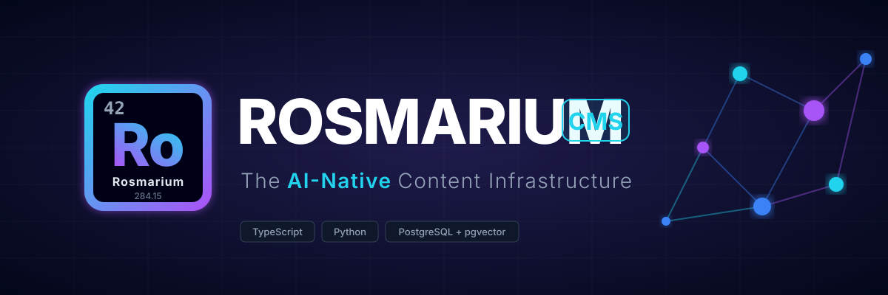

<p align="center">
  
</p>

<p align="center">
  
  
  
  
  
  
  [](https://github.com/orchestrator-dev/rosmarium/actions/workflows/ci.yml)
</p>

---

## What is Rosmarium?

**[🚀 Try the Interactive Demo](https://demo.rosmarium.com)** | **[📚 Read the Documentation](https://rosmarium.com/docs)** | **[🌐 Visit Website](https://rosmarium.com)**

Most headless CMS tools treat AI as a plugin. Rosmarium treats it as infrastructure, acting as a true Content Orchestration System (COS). Built on a split-stack architecture, a TypeScript/Fastify core handles content, auth, REST/GraphQL, and a knowledge graph layer. A Python/FastAPI background worker handles LLM embeddings, RAG pipelines, semantic search, auto-tagging, NER, and graph analytics. Both components share PostgreSQL with `pgvector` extension natively.

## Documentation

We maintain exhaustive documentation similar to FastAPI and Swagger at **[rosmarium.com/docs](https://rosmarium.com/docs)**.

Please refer to the site for detailed guides on:
- 🚀 **[Getting Started](https://rosmarium.com/docs/getting-started)**: Installation and Docker compose.
- 🏗️ **[Architecture](https://rosmarium.com/docs/architecture)**: Understanding the Node/Python decoupled structure.
- 🔌 **[API Reference](https://rosmarium.com/docs/api-reference)**: Comprehensive endpoints for REST and GraphQL.
- 🤖 **[AI Pipeline](https://rosmarium.com/docs/ai-pipeline)**: Deep dive into chunking, vector embeddings, and semantic tagging.
- 🕸️ **[Knowledge Graph](https://rosmarium.com/docs/knowledge-graph)**: Typed edges, Cypher queries, and graph analytics.

## Quick Start

```bash
# Clone and install
git clone https://github.com/orchestrator-dev/rosmarium
cd rosmarium && pnpm install

# Start infrastructure (PostgreSQL, Redis, MinIO)
pnpm infra:up && pnpm infra:init

# Configure environment and run migrations
cp .env.example .env
pnpm db:migrate
pnpm db:seed

# Start the servers in separate terminals
pnpm --filter @rosmarium-cms/server dev
cd apps/rosmarium-ai-worker && uv run uvicorn rosmarium_ai_worker.main:app --app-dir src --port 8001
pnpm --filter @rosmarium-cms/admin dev
```

## Contributing & Licence

Rosmarium is Apache 2.0 licensed. See [CONTRIBUTING.md](CONTRIBUTING.md) for how to get involved and the codebase conventions.
