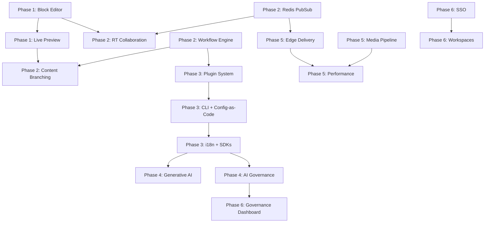

# Rosmarium V2 — Comprehensive Project Roadmap

> **Version**: 2.0 Draft | **Created**: 2026-05-30 | **Status**: Planning
>
> This document defines the Rosmarium V2 roadmap based on deep industry research across
> 8 leading CMS platforms (Strapi, Directus, Sanity, Contentful, PayloadCMS, Ghost,
> KeystoneJS, WordPress/Gutenberg), analysis of 500+ GitHub issues, Reddit/forum
> community discussions, and a comprehensive gap analysis against rosmarium v1.1.1.

---

## Table of Contents

1. [Executive Summary](#1-executive-summary)
2. [Research Methodology](#2-research-methodology)
3. [Industry Pain Points Synthesis](#3-industry-pain-points-synthesis)
4. [Rosmarium V1 Competitive Position](#4-rosmarium-v1-competitive-position)
5. [Gap Analysis (Delta)](#5-gap-analysis-delta)
6. [V2 Architecture Principles](#6-v2-architecture-principles)
7. [Phase 1 — Content Authoring Revolution](#phase-1--content-authoring-revolution-months-1-3)
8. [Phase 2 — Workflow & Collaboration Engine](#phase-2--workflow--collaboration-engine-months-4-6)
9. [Phase 3 — Developer Experience & Extensibility](#phase-3--developer-experience--extensibility-months-7-9)
10. [Phase 4 — AI-Native Content Intelligence](#phase-4--ai-native-content-intelligence-months-10-11)
11. [Phase 5 — Edge Delivery & Scale](#phase-5--edge-delivery--scale-months-12-14)
12. [Phase 6 — Enterprise & Governance](#phase-6--enterprise--governance-months-15-16)
13. [Cross-Cutting Concerns](#cross-cutting-concerns)
14. [Success Metrics](#success-metrics)
15. [Risk Register](#risk-register)

---

## 1. Executive Summary

Rosmarium V1 established a strong AI-native content orchestration foundation with knowledge
graphs, hybrid search, RAG pipelines, and intelligent metadata. V2 transforms rosmarium
from an **AI-powered CMS** into a **Content Operating System** — addressing the top pain
points identified across the CMS industry:

| V1 Strengths (Keep & Extend) | V2 New Capabilities |
|---|---|
| Knowledge Graph + Traversal | Structured Rich Text (Block Editor) |
| Hybrid BM25 + pgvector Search | Real-Time Collaboration (CRDT) |
| RAG Pipeline + Streaming | Workflow Automation Engine |
| AI Intelligence (NER, Tagging, Summarization) | Plugin/Extension System |
| Multi-Tenancy | Content Branching (Git-like) |
| RBAC (5 roles, field-level) | Generative AI Content Studio |
| GraphQL Subscriptions | Edge Delivery Network |
| Webhook Engine | Visual Live Preview |
| Content Versioning | Full i18n Framework |
| OpenTelemetry Observability | Config-as-Code + CLI |

**Key Insight**: No CMS fully bridges developer flexibility with marketer usability.
Rosmarium V2 targets this exact gap through a "hybrid-headless" approach — API-first
control for developers + visual editing for content teams.

---

## 2. Research Methodology

### Sources Analyzed

| Source | Scope | Key Findings |
|---|---|---|
| **GitHub Issues** | Strapi, Directus, Sanity, PayloadCMS, Ghost, KeystoneJS, WordPress/Gutenberg | Top upvoted feature requests and recurring bug patterns |
| **Reddit** | r/webdev, r/javascript, r/reactjs, r/cms | Developer frustrations, CMS comparisons, real-world pain points |
| **Industry Reports** | MACH Alliance, Gartner DXP quadrant, web.dev | Architectural trends, composable content, edge delivery |
| **Community Forums** | Strapi Forum, Ghost Ideas, Directus Discussions | End-user and content editor feedback |
| **Rosmarium Codebase** | Full monorepo analysis (server, admin, ai-worker, cli) | Current capabilities, architecture, limitations |

### Cross-CMS Pain Point Frequency

```
Environment sync/migration     ████████████████████ 8/8 CMS affected
Admin UI limitations            ████████████████████ 8/8
Performance with deep relations ██████████████████   7/8
i18n/Multi-language             ████████████████     6/8
Config-as-code / Git workflows  ██████████████       5/8
Upgrade reliability             ████████████         4/8
Vendor lock-in                  ████████████         4/8
TypeScript DX issues            ████████████         4/8
Documentation gaps              ██████████           3/8
Pricing unpredictability        ████████             2/8
```

---

## 3. Industry Pain Points Synthesis

### 3.1 The Editor Experience Gap (Critical — All Platforms)

**Problem**: Headless CMS platforms struggle to provide WYSIWYG experiences, forcing editors
to rely on developers for routine content updates.

**Evidence**:
- Contentful: "Clunky authoring UI, relies on custom-built previews"
- Strapi: "Copy/paste components impossible within entries"
- Ghost: "Complex layouts require significant developer intervention"
- WordPress: "WYSIWYG discrepancies — Editor appearance ≠ live site"
- Reddit: "Dependency on developers — Marketers feel locked in"

**Rosmarium V1 Gap**: richText is stored as a plain string. No block-based editor, no
visual preview, no live collaboration.

### 3.2 Workflow & Collaboration Deficit (High — 6/8 Platforms)

**Problem**: Most CMS platforms use "last edit wins" or complex locking. No CMS fully
delivers Google Docs-like real-time collaboration.

**Evidence**:
- WordPress Gutenberg Phase 3 (#61162): Real-time collaboration is the #1 priority
- Sanity: Industry-leading but still proprietary
- Strapi: No autosave (#community request), no content branching
- Contentful: Workflow retroactivity requires custom scripts

**Rosmarium V1 Gap**: Only publish/unpublish lifecycle. No customizable workflow states,
no approval chains, no content branching. In-process PubSub won't scale across instances.

### 3.3 Developer Experience & Extensibility (High — 7/8 Platforms)

**Problem**: CMS platforms either lock developers into proprietary patterns or require
excessive boilerplate. No formal plugin marketplace exists for most headless CMS.

**Evidence**:
- PayloadCMS: "Stability vs. feature velocity tension"
- Directus: "Database-first prevents Git workflows"
- KeystoneJS: "Prisma tight coupling limits database choices"
- Ghost: "Intentionally thin customization philosophy"
- Reddit: "Fear of becoming a CMS specialist limiting career growth"

**Rosmarium V1 Gap**: CLI is a placeholder. No plugin system. No config-as-code.
Schema stored only in DB. No SDK framework integrations (Next.js, Nuxt, Astro).

### 3.4 Content Modeling & Structure (Medium-High — 5/8 Platforms)

**Problem**: Content models based on layout rather than meaning lead to brittle,
non-reusable content. Flat content lists with no hierarchy or graph relationships.

**Evidence**:
- Ghost: "No custom post types or flexible structured data"
- Contentful: "Reference depth and item count limits per field"
- Strapi: "Deep population causes severe performance degradation"
- Industry trend: Content Graph > Content Tree for omnichannel delivery

**Rosmarium V1 Position**: ✅ Already strong — Knowledge Graph, 13 field types, composite
fields, components, blocks. But needs conditional fields, content hierarchy views,
and better relation performance.

### 3.5 AI Integration & Governance (Emerging — All Platforms)

**Problem**: AI is transitioning from supplemental to core CMS component, but most
platforms treat it as a bolt-on. Structured content is a prerequisite for effective AI.

**Evidence**:
- Industry: "Shift from creative generation to operational efficiency & governance"
- Reddit: "CMSs built around 'humans write, machines render' — failing to adapt"
- Community: "AI can't parse HTML blobs. Must break into atomic, machine-readable units"

**Rosmarium V1 Position**: ✅ Industry-leading with AI-native architecture. But needs
generative AI content creation, AI governance/audit trails, and content-aware AI
operations (tenant-isolated, permission-aware).

### 3.6 Multi-Tenancy & Scale (Medium — Enterprise-focused)

**Problem**: Cross-tenant data exposure, noisy neighbor effects, and compliance complexity.

**Evidence**:
- PayloadCMS: "Multi-tenancy with strict isolation requires separate Node.js processes"
- Directus: "Multi-instance management concepts requested"
- Industry: "AI operations must be tenant-aware to prevent data leakage"

**Rosmarium V1 Position**: ✅ Has multi-tenancy via X-Tenant-Id header. Needs workspace-
level RBAC, shared content across spaces, and tenant-aware AI operations.

---

## 4. Rosmarium V1 Competitive Position

### Where Rosmarium Already Leads

| Capability | Rosmarium V1 | Industry Average |
|---|---|---|
| Knowledge Graph + Traversal | ✅ Native (Cypher-lite, PageRank, Louvain, HITS) | ❌ None offer this |
| Hybrid Search (BM25 + Vector + RRF) | ✅ Native with alpha slider | ⚠️ Basic search only |
| RAG Pipeline | ✅ LlamaIndex + spaCy + streaming | ❌ No CMS has native RAG |
| AI Intelligence Pipeline | ✅ NER, tagging, summarization, duplicates | ⚠️ Sanity has AI Actions |
| Graph Export (JSON-LD, RDF, GraphML) | ✅ 4 formats | ❌ None offer this |
| Multi-Embedding Providers | ✅ Ollama, OpenAI, Cohere | ⚠️ Usually single-provider |
| Composite Content (Components, Blocks) | ✅ Recursive validation | ✅ Strapi, Payload similar |
| Open Source + Self-Hosted | ✅ Apache 2.0 | ⚠️ Mixed (Sanity/Contentful proprietary) |

### Where Rosmarium Must Catch Up

| Capability | Rosmarium V1 | Industry Leaders |
|---|---|---|
| Rich Text Editor | ❌ Plain string | ✅ Payload (Lexical), Sanity (Portable Text) |
| Real-Time Collaboration | ❌ None | ✅ Sanity (native), WordPress Phase 3 |
| Visual/Live Preview | ❌ None | ✅ Storyblok, Sanity, Payload |
| Plugin System | ❌ None | ✅ Strapi, WordPress, Directus |
| i18n Framework | ⚠️ Locale field only | ✅ Strapi, Directus, Contentful |
| Config-as-Code | ❌ DB-only schema | ✅ Payload (code-first), CloudCannon (Git) |
| CLI Tool | ❌ Placeholder | ✅ Strapi CLI, Directus CLI |
| Workflow Engine | ❌ Publish/unpublish only | ✅ Contentful, Directus Flows |
| Content Branching | ❌ None | ✅ CrafterCMS, CloudCannon |
| Scheduled Publishing | ❌ None | ✅ Most CMS platforms |
| Bulk Operations | ❌ None | ✅ Most CMS platforms |
| SSO/OAuth | ❌ Session + API key only | ✅ Enterprise CMS platforms |
| Media Processing | ❌ Raw upload only | ✅ Cloudinary integration, Imgix |
| Generative AI Content | ❌ Analysis only | ⚠️ Sanity AI, emerging |
| Content Templates | ❌ None | ✅ PayloadCMS, WordPress |

---

## 5. Gap Analysis (Delta)

### Priority Matrix

```
                    HIGH IMPACT
                        │
    ┌───────────────────┼───────────────────┐
    │                   │                   │
    │  P1: MUST HAVE    │  P2: SHOULD HAVE  │
    │                   │                   │
    │  • Block Editor   │  • Content Branch │
    │  • Workflow Engine│  • Edge Delivery  │
    │  • Plugin System  │  • Generative AI  │
    │  • i18n Framework │  • A/B Testing    │
    │  • CLI Tool       │  • Media Process  │
    │  • Live Preview   │  • SSO/OAuth      │
    │  • Config-as-Code │  • Audit Dashboard│
    │                   │                   │
HIGH├───────────────────┼───────────────────┤LOW
FREQ│                   │                   │FREQ
    │  P3: NICE TO HAVE │  P4: FUTURE       │
    │                   │                   │
    │  • RT Collab      │  • Personalizatn  │
    │  • Bulk Ops       │  • Headless Forms │
    │  • Scheduled Pub  │  • eCommerce      │
    │  • Conditional    │  • GraphQL Feder  │
    │    Fields         │  • Multi-DB       │
    │  • Content Templ  │                   │
    │  • Import/Export  │                   │
    │                   │                   │
    └───────────────────┼───────────────────┘
                        │
                    LOW IMPACT
```

### Full Delta Inventory

| # | Gap | Priority | Phase | Industry Pressure | Complexity |
|---|---|---|---|---|---|
| G01 | Structured Rich Text (Block Editor) | P1 | 1 | Critical (8/8) | High |
| G02 | Visual Live Preview | P1 | 1 | Critical (7/8) | Medium |
| G03 | Content Templates | P3 | 1 | Medium (4/8) | Low |
| G04 | Conditional Fields | P3 | 1 | Medium (3/8) | Medium |
| G05 | Workflow Automation Engine | P1 | 2 | High (6/8) | High |
| G06 | Real-Time Collaboration (CRDT) | P3 | 2 | High (3/8) | Very High |
| G07 | Content Branching (Git-like) | P2 | 2 | High (4/8) | High |
| G08 | Commenting & Annotations | P3 | 2 | Medium (3/8) | Medium |
| G09 | Plugin/Extension System | P1 | 3 | Critical (7/8) | High |
| G10 | CLI Tool (Full Implementation) | P1 | 3 | High (6/8) | Medium |
| G11 | Config-as-Code & Migrations | P1 | 3 | Critical (5/8) | High |
| G12 | SDK/Framework Integrations | P1 | 3 | High (5/8) | Medium |
| G13 | Full i18n Framework | P1 | 3 | High (6/8) | High |
| G14 | Import/Export & Data Migration | P3 | 3 | High (5/8) | Medium |
| G15 | Generative AI Content Studio | P2 | 4 | Emerging (All) | High |
| G16 | AI Governance & Audit | P2 | 4 | Emerging (All) | Medium |
| G17 | Semantic Search Enhancements | P3 | 4 | Medium | Medium |
| G18 | Edge Delivery Network | P2 | 5 | High (3/8) | Very High |
| G19 | Scheduled Publishing | P3 | 5 | Medium (5/8) | Low |
| G20 | Bulk Operations | P3 | 5 | Medium (4/8) | Low |
| G21 | Media Processing Pipeline | P2 | 5 | High (5/8) | Medium |
| G22 | SSO/OAuth/OIDC | P2 | 6 | High (Enterprise) | Medium |
| G23 | Advanced RBAC (Workspaces) | P2 | 6 | Medium (Enterprise) | High |
| G24 | Content Governance Dashboard | P2 | 6 | Medium (Enterprise) | Medium |
| G25 | Compliance Engine (GDPR, HIPAA) | P2 | 6 | High (Enterprise) | High |
| G26 | Redis PubSub (Multi-Instance) | P1 | 2 | Blocker | Low |

---

## 6. V2 Architecture Principles

### Design Tenets

1. **Content-as-Data, Not Content-as-Pages** — Entity-centric, graph-based models for
   AI consumption and omnichannel delivery
2. **AI-Native, Not AI-Bolted** — Structured content as prerequisite; governance and
   audit trails mandatory; tenant-aware AI operations
3. **Hybrid-Headless** — API-first control for developers + visual editing for marketers
4. **Composable** — Plugin system, SDK integrations, webhook/event architecture
5. **Git-Like Content Workflows** — Branching, merging, review for content
6. **Edge-First** — Performance and personalization at the edge
7. **Open & Portable** — Apache 2.0, self-hosted, standards-based (JSON-LD, RDF, OpenAPI)

### Technical Architecture Evolution

```
                    Rosmarium V2 Architecture
    ┌──────────────────────────────────────────────────┐
    │                   Edge Layer                     │
    │  ┌──────────┐  ┌──────────┐  ┌───────────────┐  │
    │  │ CDN Cache │  │ Edge KV  │  │ Edge Functions│  │
    │  └──────────┘  └──────────┘  └───────────────┘  │
    └──────────────────────┬───────────────────────────┘
                           │
    ┌──────────────────────┴───────────────────────────┐
    │                 API Gateway                       │
    │  REST + GraphQL + WebSocket + SSE                │
    └──────────────────────┬───────────────────────────┘
                           │
    ┌──────────────────────┴───────────────────────────┐
    │              Core Server (Fastify)               │
    │  ┌─────────┐ ┌──────────┐ ┌───────────────────┐ │
    │  │ Content  │ │ Workflow │ │  Plugin Runtime   │ │
    │  │ Engine   │ │ Engine   │ │  (Hook System)    │ │
    │  ├─────────┤ ├──────────┤ ├───────────────────┤ │
    │  │ Auth     │ │ Collab   │ │  i18n Engine      │ │
    │  │ + SSO    │ │ (CRDT)   │ │                   │ │
    │  ├─────────┤ ├──────────┤ ├───────────────────┤ │
    │  │ RBAC     │ │ Preview  │ │  Media Pipeline   │ │
    │  │ + Spaces │ │ Engine   │ │  (Sharp/libvips)  │ │
    │  └─────────┘ └──────────┘ └───────────────────┘ │
    └──────────────────────┬───────────────────────────┘
                           │
    ┌──────────────────────┴───────────────────────────┐
    │              AI Worker (FastAPI)                  │
    │  ┌─────────┐ ┌──────────┐ ┌───────────────────┐ │
    │  │ Embed   │ │ Intelli- │ │  Generative AI    │ │
    │  │ Pipeline │ │ gence    │ │  Studio           │ │
    │  ├─────────┤ ├──────────┤ ├───────────────────┤ │
    │  │ RAG     │ │ Graph    │ │  Translation      │ │
    │  │ Pipeline │ │ Inference│ │  Engine           │ │
    │  └─────────┘ └──────────┘ └───────────────────┘ │
    └──────────────────────┬───────────────────────────┘
                           │
    ┌──────────────────────┴───────────────────────────┐
    │                 Data Layer                        │
    │  ┌──────────┐ ┌──────────┐ ┌───────────────────┐ │
    │  │PostgreSQL│ │  Redis   │ │ S3 (MinIO)        │ │
    │  │+ pgvector│ │ (PubSub  │ │ + Media Pipeline  │ │
    │  │          │ │  + Queue)│ │                   │ │
    │  └──────────┘ └──────────┘ └───────────────────┘ │
    └──────────────────────────────────────────────────┘
```

---

## Phase 1 — Content Authoring Revolution (Months 1-3)

> **Goal**: Transform the content editing experience from plain-string storage to a
> structured block editor with live preview, closing the #1 industry pain point.

### Month 1: Structured Rich Text Engine (G01)

#### Task 1.1: Block-Based Document Model

**What**: Replace plain-string richText storage with a structured block-based document
model inspired by Sanity's Portable Text and Payload's Lexical integration.

**Why**: "AI can't parse HTML blobs" — every major CMS is moving to structured rich text.
This is prerequisite for AI content operations, omnichannel delivery, and collaborative
editing.

**Technical Specification**:

```typescript
// New file: packages/types/src/block-document.ts

interface BlockDocument {
  version: 1;
  blocks: Block[];
}

type Block =
  | ParagraphBlock
  | HeadingBlock
  | ImageBlock
  | CodeBlock
  | QuoteBlock
  | ListBlock
  | TableBlock
  | EmbedBlock
  | DividerBlock
  | ComponentBlock;  // Reuses existing component system

interface ParagraphBlock {
  type: 'paragraph';
  id: string;          // UUID for CRDT addressing
  children: InlineNode[];
}

interface InlineNode {
  type: 'text' | 'link' | 'mention' | 'inline-code';
  text: string;
  marks?: Mark[];      // bold, italic, underline, strikethrough, code
}
```

**Implementation**:

| File | Action | Details |
|---|---|---|
| `packages/types/src/block-document.ts` | NEW | Block document type definitions |
| `apps/rosmarium-server/src/modules/content/field-types.ts` | MODIFY | Update `richText` field to accept `BlockDocument \| string` (backward compat) |
| `apps/rosmarium-server/src/modules/content/block-serializer.ts` | NEW | Serialize blocks to HTML, Markdown, plain text, AMP |
| `apps/rosmarium-server/src/modules/content/block-serializer.test.ts` | NEW | Tests for all serialization formats |
| DB migration | NEW | Add `richtext_format` column to `content_types` settings |

**Acceptance Criteria**:
- [ ] BlockDocument schema defined with Zod validation
- [ ] Backward compatible — existing string richText continues to work
- [ ] Serializers for HTML, Markdown, plaintext output
- [ ] Search vector generation works with block content (extract text from blocks)
- [ ] AI intelligence pipeline processes block content (extract text for NER, tagging)
- [ ] All existing tests pass
- [ ] New tests: block validation (15+), serialization (20+)

#### Task 1.2: Tiptap/ProseMirror Editor Integration

**What**: Integrate Tiptap v2 (ProseMirror-based) as the block editor in rosmarium-admin.

**Why**: Tiptap is the most extensible open-source rich text editor, used by GitLab,
Substack, and others. ProseMirror foundation enables future CRDT collaboration.

**Implementation**:

| File | Action | Details |
|---|---|---|
| `apps/rosmarium-admin/package.json` | MODIFY | Add `@tiptap/react`, `@tiptap/starter-kit`, `@tiptap/extension-*` |
| `apps/rosmarium-admin/src/components/editor/BlockEditor.tsx` | NEW | Main editor component with toolbar, slash commands |
| `apps/rosmarium-admin/src/components/editor/extensions/` | NEW | Custom Tiptap extensions for rosmarium blocks |
| `apps/rosmarium-admin/src/components/editor/BlockEditor.css` | NEW | Editor styles matching MUI theme |
| `apps/rosmarium-admin/src/components/editor/MenuBar.tsx` | NEW | Floating toolbar with formatting options |
| `apps/rosmarium-admin/src/components/editor/SlashMenu.tsx` | NEW | Slash command menu for inserting blocks |

**Acceptance Criteria**:
- [ ] Rich text editing with paragraph, headings (H1-H6), lists, blockquotes, code blocks
- [ ] Inline formatting: bold, italic, underline, strikethrough, code, links
- [ ] Image block with drag-and-drop upload to S3/MinIO
- [ ] Table block with add/remove rows/columns
- [ ] Slash command menu (`/`) for quick block insertion
- [ ] Data persisted as BlockDocument JSON
- [ ] Keyboard shortcuts matching standard conventions
- [ ] Editor renders existing string richText content (migration path)

#### Task 1.3: Content Templates System (G03)

**What**: Allow saving content entries as reusable templates.

**Implementation**:

| File | Action | Details |
|---|---|---|
| `apps/rosmarium-server/src/db/schema/templates.ts` | NEW | `content_templates` table |
| `apps/rosmarium-server/src/modules/content/templates.service.ts` | NEW | Template CRUD + apply logic |
| `apps/rosmarium-server/src/modules/content/templates.routes.ts` | NEW | REST endpoints |
| DB migration | NEW | `content_templates` table |

**Schema**:
```sql
CREATE TABLE content_templates (
  id UUID PRIMARY KEY DEFAULT gen_random_uuid(),
  name VARCHAR(255) NOT NULL,
  description TEXT,
  content_type_id UUID REFERENCES content_types(id),
  template_data JSONB NOT NULL,
  is_global BOOLEAN DEFAULT false,
  created_by UUID REFERENCES users(id),
  created_at TIMESTAMPTZ DEFAULT now(),
  updated_at TIMESTAMPTZ DEFAULT now()
);
```

**Acceptance Criteria**:
- [ ] CRUD endpoints: `POST/GET/PATCH/DELETE /api/templates`
- [ ] `POST /api/content/:type/from-template/:templateId` — create entry from template
- [ ] Templates scoped to content type or global
- [ ] Admin UI: "Save as Template" button in content editor
- [ ] Admin UI: Template picker when creating new content
- [ ] Tests: 10+ template service tests

---

### Month 2: Live Preview Engine (G02)

#### Task 2.1: Preview API & Token System

**What**: Implement a secure preview system that allows frontend applications to render
draft content in real-time.

**Why**: "Headless CMS platforms struggle to provide WYSIWYG experiences" — the #1 pain
point across all platforms. This bridges the developer/marketer gap.

**Implementation**:

| File | Action | Details |
|---|---|---|
| `apps/rosmarium-server/src/modules/preview/preview.service.ts` | NEW | Preview token generation (JWT, 1hr expiry), draft content resolution |
| `apps/rosmarium-server/src/modules/preview/preview.routes.ts` | NEW | `POST /api/preview/token`, `GET /api/preview/:type/:id` |
| `apps/rosmarium-server/src/modules/preview/preview.middleware.ts` | NEW | Preview mode middleware (bypass publish status filter) |
| `packages/sdk/src/preview.ts` | NEW | SDK preview client with iframe messaging protocol |
| `apps/rosmarium-admin/src/components/preview/PreviewPanel.tsx` | NEW | Side-by-side preview panel in content editor |
| `apps/rosmarium-admin/src/components/preview/PreviewSettings.tsx` | NEW | Preview URL configuration per content type |

**Preview Protocol**:
```
Admin Editor                        Frontend App
    │                                    │
    ├── POST /api/preview/token ────────►│
    │◄── JWT preview token ──────────────┤
    │                                    │
    ├── postMessage({ type: 'preview',   │
    │    token, entryId, data }) ────────►│
    │                                    │
    │◄── postMessage({ type: 'ready' }) ─┤
    │                                    │
    ├── [on field change] ──────────────►│
    │    postMessage({ type: 'update',   │
    │    path, value }) ────────────────►│
    │                                    │
```

**Acceptance Criteria**:
- [ ] Preview tokens: JWT with 1hr TTL, scoped to entry + content type
- [ ] Preview API serves draft content with preview token auth
- [ ] Admin UI: preview panel with configurable URL per content type
- [ ] Real-time preview updates via postMessage on field changes
- [ ] Device toggle (desktop, tablet, mobile) in preview panel
- [ ] SDK helper for frontend apps to consume preview data
- [ ] Tests: 15+ (token generation, validation, draft resolution)

#### Task 2.2: Conditional Fields (G04)

**What**: Show/hide fields in the content editor based on other field values.

**Why**: Requested across Directus, KeystoneJS, and others. Reduces editor clutter
and prevents invalid data combinations.

**Implementation**:

| File | Action | Details |
|---|---|---|
| `packages/types/src/field-conditions.ts` | NEW | Condition schema types |
| `apps/rosmarium-server/src/modules/content/field-types.ts` | MODIFY | Add `conditions` to `baseField` schema |
| `apps/rosmarium-admin/src/components/editor/ConditionalField.tsx` | NEW | Wrapper that evaluates conditions |
| `apps/rosmarium-admin/src/hooks/useFieldConditions.ts` | NEW | Hook for condition evaluation logic |

**Condition Schema**:
```typescript
interface FieldCondition {
  field: string;          // field name to evaluate
  operator: 'eq' | 'neq' | 'contains' | 'gt' | 'lt' | 'exists' | 'empty';
  value?: unknown;        // comparison value
  logic?: 'and' | 'or';  // combine multiple conditions
}

// Example: Show "eventDate" only when type === "event"
{
  name: "eventDate",
  type: "datetime",
  conditions: [
    { field: "contentCategory", operator: "eq", value: "event" }
  ]
}
```

**Acceptance Criteria**:
- [ ] Conditions defined in content type field schema
- [ ] Admin UI dynamically shows/hides fields based on conditions
- [ ] Server-side validation respects conditions (conditional required fields)
- [ ] Content Type Builder UI for adding conditions to fields
- [ ] Tests: 10+ condition evaluation tests

---

### Month 3: Admin UI Polish & Content Hierarchy

#### Task 3.1: Content Tree View

**What**: Add hierarchical tree view alongside the existing flat list, using the
knowledge graph edges to derive parent-child relationships.

**Implementation**:

| File | Action | Details |
|---|---|---|
| `apps/rosmarium-admin/src/pages/ContentTree.tsx` | NEW | Tree view using graph edges |
| `apps/rosmarium-admin/src/components/content/TreeNode.tsx` | NEW | Recursive tree node component |
| `apps/rosmarium-server/src/modules/content/hierarchy.service.ts` | NEW | Build hierarchy from graph edges with `parent_of` type |

**Acceptance Criteria**:
- [ ] Toggle between list view and tree view
- [ ] Drag-and-drop reordering within tree
- [ ] Uses existing graph_edges with `parent_of` edge type
- [ ] Breadcrumb navigation within hierarchy
- [ ] Performance: handles 1000+ entries with virtualization

#### Task 3.2: Bulk Operations (G20)

**What**: Multi-select entries for batch publish, unpublish, delete, tag.

**Implementation**:

| File | Action | Details |
|---|---|---|
| `apps/rosmarium-server/src/modules/content/bulk.service.ts` | NEW | Batch operations with transaction support |
| `apps/rosmarium-server/src/modules/content/bulk.routes.ts` | NEW | `POST /api/content/bulk/:action` |
| `apps/rosmarium-admin/src/components/content/BulkActionBar.tsx` | NEW | Floating action bar on multi-select |

**Acceptance Criteria**:
- [ ] Bulk publish, unpublish, delete, archive
- [ ] Bulk AI operations (tag, summarize, detect duplicates)
- [ ] Transaction-wrapped (all-or-nothing)
- [ ] Progress indicator for large batches
- [ ] RBAC enforcement per entry
- [ ] Tests: 10+ bulk operation tests

---

## Phase 2 — Workflow & Collaboration Engine (Months 4-6)

> **Goal**: Build a customizable workflow engine and real-time collaboration,
> addressing the #2 industry pain point.

### Month 4: Workflow Automation Engine (G05)

#### Task 4.1: Workflow State Machine

**What**: Implement a configurable workflow engine supporting custom states, transitions,
and approval chains.

**Why**: "Only publish/unpublish" is the #1 limitation of simple CMS platforms.
Enterprise users need draft → review → legal → approved → published workflows.

**Technical Specification**:

```typescript
// New file: packages/types/src/workflow.ts

interface WorkflowDefinition {
  id: string;
  name: string;
  contentTypes: string[];       // Which content types use this workflow
  states: WorkflowState[];
  transitions: WorkflowTransition[];
  initialState: string;
  publishedState: string;       // Which state = "published"
}

interface WorkflowState {
  key: string;                   // e.g., "draft", "review", "approved"
  label: string;
  color: string;                 // UI badge color
  permissions: {
    edit: string[];              // Roles that can edit in this state
    view: string[];              // Roles that can view in this state
  };
}

interface WorkflowTransition {
  from: string;                  // State key
  to: string;                    // State key
  label: string;                 // e.g., "Submit for Review"
  requiredRole: string;          // Minimum role to trigger
  requireComment: boolean;       // Force reviewer to leave a note
  autoAssign?: string;           // Auto-assign to role/user
  webhookEvent?: string;         // Custom webhook event name
  conditions?: TransitionCondition[];
}
```

**Implementation**:

| File | Action | Details |
|---|---|---|
| `packages/types/src/workflow.ts` | NEW | Workflow type definitions |
| `apps/rosmarium-server/src/db/schema/workflows.ts` | NEW | `workflows` + `workflow_history` tables |
| `apps/rosmarium-server/src/modules/workflow/workflow.service.ts` | NEW | State machine engine, transition validation |
| `apps/rosmarium-server/src/modules/workflow/workflow.routes.ts` | NEW | CRUD + transition endpoints |
| `apps/rosmarium-server/src/modules/content/crud.service.ts` | MODIFY | Integrate workflow state into content lifecycle |
| `apps/rosmarium-admin/src/components/workflow/WorkflowBuilder.tsx` | NEW | Visual workflow designer (drag nodes/edges) |
| `apps/rosmarium-admin/src/components/workflow/WorkflowTimeline.tsx` | NEW | Entry workflow history timeline |
| DB migration | NEW | `workflows`, `workflow_history`, `workflow_assignments` tables |

**Database Schema**:
```sql
CREATE TABLE workflows (
  id UUID PRIMARY KEY DEFAULT gen_random_uuid(),
  name VARCHAR(255) NOT NULL,
  definition JSONB NOT NULL,   -- WorkflowDefinition
  is_default BOOLEAN DEFAULT false,
  tenant_id UUID REFERENCES tenants(id),
  created_at TIMESTAMPTZ DEFAULT now(),
  updated_at TIMESTAMPTZ DEFAULT now()
);

CREATE TABLE workflow_history (
  id UUID PRIMARY KEY DEFAULT gen_random_uuid(),
  entry_id UUID REFERENCES content_entries(id) ON DELETE CASCADE,
  from_state VARCHAR(100),
  to_state VARCHAR(100) NOT NULL,
  transition_label VARCHAR(255),
  comment TEXT,
  performed_by UUID REFERENCES users(id),
  performed_at TIMESTAMPTZ DEFAULT now()
);

CREATE TABLE workflow_assignments (
  id UUID PRIMARY KEY DEFAULT gen_random_uuid(),
  entry_id UUID REFERENCES content_entries(id) ON DELETE CASCADE,
  assigned_to UUID REFERENCES users(id),
  assigned_by UUID REFERENCES users(id),
  state VARCHAR(100) NOT NULL,
  is_active BOOLEAN DEFAULT true,
  created_at TIMESTAMPTZ DEFAULT now()
);
```

**Acceptance Criteria**:
- [ ] Workflow CRUD: create/update/delete workflow definitions
- [ ] Transition validation: role check, condition evaluation, required comments
- [ ] Workflow history: full audit trail of all state changes
- [ ] Assignment system: auto-assign or manual assign on transition
- [ ] Default workflow: `draft → in_review → approved → published → archived`
- [ ] Custom workflows: unlimited states and transitions
- [ ] Webhook events fired on transitions
- [ ] Admin UI: workflow timeline on entry detail page
- [ ] Admin UI: visual workflow builder in settings
- [ ] Tests: 25+ (state machine, transitions, permissions, history)

#### Task 4.2: Scheduled Publishing (G19)

**What**: Allow entries to be scheduled for future publication and unpublication.

**Implementation**:

| File | Action | Details |
|---|---|---|
| `apps/rosmarium-server/src/modules/content/scheduler.service.ts` | NEW | BullMQ delayed jobs for scheduled publish/unpublish |
| `apps/rosmarium-server/src/modules/content/scheduler.routes.ts` | NEW | `POST /api/content/:type/:id/schedule` |
| `apps/rosmarium-admin/src/components/content/ScheduleDialog.tsx` | NEW | Date/time picker for scheduling |

**Acceptance Criteria**:
- [ ] Schedule publish at specific datetime
- [ ] Schedule unpublish (expiry) at specific datetime
- [ ] BullMQ delayed job with exact timing
- [ ] Timezone-aware scheduling
- [ ] Cancel/reschedule capability
- [ ] Admin UI: schedule indicator on content list
- [ ] Tests: 10+ scheduler tests

---

### Month 5: Content Branching & Environments (G07)

#### Task 5.1: Content Branching System

**What**: Implement git-like content branching — create branches, make changes in
isolation, preview, and merge to production.

**Why**: "Content branches let teams work on updates in isolation, preview, and merge to
production — just like software code." Highly desired but poorly served across all CMS.

**Technical Specification**:

```typescript
interface ContentBranch {
  id: string;
  name: string;          // e.g., "summer-campaign", "homepage-redesign"
  baseBranchId: string | null;  // null = main branch
  status: 'active' | 'merged' | 'abandoned';
  createdBy: string;
  createdAt: Date;
  mergedAt?: Date;
  mergedBy?: string;
}

interface BranchEntry {
  branchId: string;
  entryId: string;
  action: 'create' | 'update' | 'delete';
  data: Record<string, unknown>;     // Changed data
  originalData?: Record<string, unknown>; // For diff
}
```

**Implementation**:

| File | Action | Details |
|---|---|---|
| `apps/rosmarium-server/src/db/schema/branches.ts` | NEW | `content_branches`, `branch_entries` tables |
| `apps/rosmarium-server/src/modules/branches/branch.service.ts` | NEW | Branch CRUD, diff, merge logic |
| `apps/rosmarium-server/src/modules/branches/merge.service.ts` | NEW | Three-way merge with conflict detection |
| `apps/rosmarium-server/src/modules/branches/branch.routes.ts` | NEW | Branch REST endpoints |
| `apps/rosmarium-admin/src/pages/Branches.tsx` | NEW | Branch management UI |
| `apps/rosmarium-admin/src/components/branches/BranchSwitcher.tsx` | NEW | Branch selector in header |
| `apps/rosmarium-admin/src/components/branches/MergeDialog.tsx` | NEW | Merge review with conflict resolution |
| DB migration | NEW | Branching tables |

**Acceptance Criteria**:
- [ ] Create branch from main or another branch
- [ ] Edit content within branch (isolated from main)
- [ ] Visual diff: side-by-side comparison of changes
- [ ] Merge branch to main with conflict detection
- [ ] Conflict resolution UI for field-level conflicts
- [ ] Branch-aware preview (preview branch content)
- [ ] Branch-aware API (X-Branch-Id header)
- [ ] Delete/abandon branches
- [ ] Branch history and audit trail
- [ ] Tests: 20+ (branching, merging, conflicts, API filtering)

---

### Month 6: Real-Time Collaboration Foundation (G06, G26)

#### Task 6.1: Redis PubSub for Multi-Instance (G26)

**What**: Replace in-process PubSub with Redis PubSub for GraphQL subscriptions.

**Why**: Current `createPubSub()` is in-process — subscriptions won't work when
running multiple server instances behind a load balancer. This is a prerequisite
for real-time collaboration and horizontal scaling.

**Implementation**:

| File | Action | Details |
|---|---|---|
| `apps/rosmarium-server/src/graphql/pubsub.ts` | NEW | Redis-backed PubSub adapter |
| `apps/rosmarium-server/src/graphql/index.ts` | MODIFY | Replace `createPubSub()` with Redis PubSub |

**Acceptance Criteria**:
- [ ] GraphQL subscriptions work across multiple server instances
- [ ] Graceful fallback to in-process PubSub if Redis unavailable
- [ ] Presence events (user online/offline) via Redis
- [ ] Tests: 5+ PubSub integration tests

#### Task 6.2: Collaborative Presence & Locking

**What**: Show who is currently editing a content entry, with soft locking to
prevent conflicts.

**Implementation**:

| File | Action | Details |
|---|---|---|
| `apps/rosmarium-server/src/modules/collab/presence.service.ts` | NEW | User presence tracking via Redis HASH + TTL |
| `apps/rosmarium-server/src/modules/collab/presence.routes.ts` | NEW | WebSocket presence channel |
| `apps/rosmarium-admin/src/components/collab/PresenceAvatars.tsx` | NEW | Avatar stack showing active editors |
| `apps/rosmarium-admin/src/components/collab/EditingIndicator.tsx` | NEW | "User X is editing this field" indicator |

**Acceptance Criteria**:
- [ ] Real-time presence: see who is viewing/editing each entry
- [ ] Soft lock warnings (not hard locks)
- [ ] Field-level editing indicators
- [ ] Auto-disconnect on tab close/idle (30s heartbeat)
- [ ] Admin UI: avatar stack on content list + editor

#### Task 6.3: Commenting & Annotations (G08)

**What**: Inline commenting on content entries and fields for editorial review.

**Implementation**:

| File | Action | Details |
|---|---|---|
| `apps/rosmarium-server/src/db/schema/comments.ts` | NEW | `content_comments` table |
| `apps/rosmarium-server/src/modules/collab/comments.service.ts` | NEW | Comment CRUD, thread resolution |
| `apps/rosmarium-server/src/modules/collab/comments.routes.ts` | NEW | REST + GraphQL subscription |
| `apps/rosmarium-admin/src/components/collab/CommentThread.tsx` | NEW | Comment thread UI |
| `apps/rosmarium-admin/src/components/collab/InlineComment.tsx` | NEW | Field-level comment annotation |

**Acceptance Criteria**:
- [ ] Comments on entry level and field level
- [ ] Threaded replies
- [ ] Resolve/reopen threads
- [ ] @mention users (with notification webhook)
- [ ] Comment history preserved across versions
- [ ] Tests: 15+ comment service tests

---

## Phase 3 — Developer Experience & Extensibility (Months 7-9)

> **Goal**: Build the developer platform layer — plugin system, CLI, config-as-code,
> SDK integrations, and i18n — addressing the #3 industry pain point.

### Month 7: Plugin/Extension System (G09)

#### Task 7.1: Plugin Architecture

**What**: Implement a hook-based plugin system allowing third-party extensions to
modify content lifecycle, add API routes, register field types, and extend the admin UI.

**Why**: Every successful CMS has an extension mechanism. "No formal plugin system"
is rosmarium's biggest DX gap. This unlocks ecosystem growth.

**Technical Specification**:

```typescript
// New file: packages/types/src/plugin.ts

interface RosmariumPlugin {
  name: string;
  version: string;
  description?: string;

  // Server-side hooks
  hooks?: {
    // Content lifecycle
    'content:beforeCreate'?: (ctx: HookContext) => Promise<void>;
    'content:afterCreate'?: (ctx: HookContext) => Promise<void>;
    'content:beforeUpdate'?: (ctx: HookContext) => Promise<void>;
    'content:afterUpdate'?: (ctx: HookContext) => Promise<void>;
    'content:beforeDelete'?: (ctx: HookContext) => Promise<void>;
    'content:afterDelete'?: (ctx: HookContext) => Promise<void>;
    'content:beforePublish'?: (ctx: HookContext) => Promise<void>;
    'content:afterPublish'?: (ctx: HookContext) => Promise<void>;

    // Workflow hooks
    'workflow:beforeTransition'?: (ctx: WorkflowHookContext) => Promise<void>;
    'workflow:afterTransition'?: (ctx: WorkflowHookContext) => Promise<void>;

    // Auth hooks
    'auth:afterLogin'?: (ctx: AuthHookContext) => Promise<void>;
    'auth:afterRegister'?: (ctx: AuthHookContext) => Promise<void>;

    // Media hooks
    'media:beforeUpload'?: (ctx: MediaHookContext) => Promise<void>;
    'media:afterUpload'?: (ctx: MediaHookContext) => Promise<void>;
  };

  // Custom REST routes
  routes?: (fastify: FastifyInstance) => void;

  // Custom field types
  fieldTypes?: CustomFieldType[];

  // Custom GraphQL extensions
  graphql?: {
    types?: (builder: PothosSchemaBuilder) => void;
    queries?: (builder: PothosSchemaBuilder) => void;
    mutations?: (builder: PothosSchemaBuilder) => void;
  };

  // Admin UI extensions (loaded dynamically)
  adminUI?: {
    pages?: AdminPage[];
    widgets?: DashboardWidget[];
    fieldEditors?: Record<string, string>;  // fieldType → component path
  };
}
```

**Implementation**:

| File | Action | Details |
|---|---|---|
| `packages/types/src/plugin.ts` | NEW | Plugin interface definitions |
| `apps/rosmarium-server/src/plugins/plugin-registry.ts` | NEW | Plugin discovery, loading, validation |
| `apps/rosmarium-server/src/plugins/hook-engine.ts` | NEW | Hook execution with priority ordering, error isolation |
| `apps/rosmarium-server/src/plugins/plugin-loader.ts` | NEW | Dynamic import of plugin packages |
| `apps/rosmarium-server/src/modules/content/crud.service.ts` | MODIFY | Integrate hook engine at lifecycle points |
| `apps/rosmarium-server/src/config.ts` | MODIFY | Add `plugins` config section |
| `apps/rosmarium-admin/src/plugins/PluginHost.tsx` | NEW | Dynamic admin UI plugin loader |

**Plugin Loading**:
```typescript
// rosmarium.config.ts (new project root config file)
import type { RosmariumConfig } from '@rosmarium/types';

export default {
  plugins: [
    '@rosmarium/plugin-seo',
    '@rosmarium/plugin-redirects',
    './my-custom-plugin',
  ],
  // ... other config
} satisfies RosmariumConfig;
```

**Acceptance Criteria**:
- [ ] Plugins loaded from npm packages or local paths
- [ ] Hook system with priority ordering (0-100)
- [ ] Error isolation — one plugin crash doesn't affect others
- [ ] Plugins can register custom REST routes
- [ ] Plugins can register custom field types
- [ ] Plugins can extend GraphQL schema
- [ ] Plugin validation on startup (name, version, dependency checks)
- [ ] Admin UI: plugin management page (list, enable/disable)
- [ ] Example plugin: `@rosmarium/plugin-seo` (SEO fields, sitemap generation)
- [ ] Tests: 20+ (loading, hooks, error isolation, lifecycle)

---

### Month 8: CLI & Config-as-Code (G10, G11)

#### Task 8.1: CLI Implementation

**What**: Full CLI tool replacing the Go placeholder with a TypeScript CLI built on
Commander.js.

**Why**: Every successful CMS has a CLI. Required for config-as-code, migration tooling,
and developer workflows.

**Implementation**: Rewrite `apps/rosmarium-cli` in TypeScript:

| File | Action | Details |
|---|---|---|
| `apps/rosmarium-cli/` | REWRITE | TypeScript CLI with Commander.js |
| `apps/rosmarium-cli/src/commands/init.ts` | NEW | `rosmarium init` — scaffold new project |
| `apps/rosmarium-cli/src/commands/dev.ts` | NEW | `rosmarium dev` — start dev server |
| `apps/rosmarium-cli/src/commands/schema/pull.ts` | NEW | `rosmarium schema pull` — export DB schema to files |
| `apps/rosmarium-cli/src/commands/schema/push.ts` | NEW | `rosmarium schema push` — apply schema files to DB |
| `apps/rosmarium-cli/src/commands/schema/diff.ts` | NEW | `rosmarium schema diff` — show schema differences |
| `apps/rosmarium-cli/src/commands/content/export.ts` | NEW | `rosmarium content export` — export content to JSON |
| `apps/rosmarium-cli/src/commands/content/import.ts` | NEW | `rosmarium content import` — import content from JSON |
| `apps/rosmarium-cli/src/commands/plugin/add.ts` | NEW | `rosmarium plugin add <name>` |
| `apps/rosmarium-cli/src/commands/migrate.ts` | NEW | `rosmarium migrate` — run DB migrations |

**CLI Commands**:
```
rosmarium init [dir]              # Scaffold new rosmarium project
rosmarium dev                     # Start development server
rosmarium build                   # Build for production
rosmarium schema pull             # Export content type schemas to ./schemas/
rosmarium schema push             # Push schema files to database
rosmarium schema diff             # Show delta between files and DB
rosmarium content export [--type] # Export content entries to JSON/YAML
rosmarium content import <file>   # Import content from JSON/YAML
rosmarium plugin add <name>       # Install and register a plugin
rosmarium plugin remove <name>    # Uninstall a plugin
rosmarium migrate                 # Run pending DB migrations
rosmarium seed [--demo]           # Seed database
rosmarium env sync <target>       # Sync schema between environments
```

**Acceptance Criteria**:
- [ ] All commands above implemented and tested
- [ ] `rosmarium init` creates a working project from template
- [ ] `rosmarium schema pull/push/diff` enables config-as-code workflow
- [ ] Published to npm as `@rosmarium/cli` (or `rosmarium`)
- [ ] Interactive prompts with `inquirer` for guided setup
- [ ] Colorized output, progress bars, error formatting
- [ ] Tests: 15+ CLI command tests

#### Task 8.2: Config-as-Code System (G11)

**What**: Enable content type schemas to be defined in code files and synced
bidirectionally with the database.

**Why**: "Database-first architecture prevents Git workflows" is the #2 pain point
for Directus. Config-as-code enables CI/CD, code review, and environment sync.

**Schema File Format** (YAML):
```yaml
# schemas/article.yml
name: article
displayName: Article
settings:
  aiIntelligence:
    enabled: true
fields:
  - name: title
    type: text
    label: Title
    required: true
    maxLength: 200

  - name: slug
    type: slug
    label: URL Slug
    generatedFrom: title

  - name: body
    type: richText
    label: Body
    required: true

  - name: author
    type: relation
    label: Author
    targetContentType: author
    many: false

  - name: tags
    type: select
    label: Tags
    options:
      - { label: Technology, value: tech }
      - { label: Science, value: science }
      - { label: Culture, value: culture }
```

**Implementation**:

| File | Action | Details |
|---|---|---|
| `apps/rosmarium-server/src/modules/content/schema-sync.service.ts` | NEW | Bidirectional schema sync (DB ↔ YAML files) |
| `apps/rosmarium-server/src/modules/content/schema-diff.ts` | NEW | Schema diff algorithm (detect adds, removes, changes) |
| `apps/rosmarium-server/src/modules/content/schema-serializer.ts` | NEW | Serialize/deserialize YAML schema files |

**Acceptance Criteria**:
- [ ] `rosmarium schema pull` exports all content types to `./schemas/*.yml`
- [ ] `rosmarium schema push` creates/updates content types from YAML files
- [ ] `rosmarium schema diff` shows human-readable delta
- [ ] Conflict detection when DB and files diverge
- [ ] Supports all 13+ field types including nested components
- [ ] Environment sync: `rosmarium env sync staging` (push local schema to remote)
- [ ] Tests: 15+ (serialization, diff, sync, conflict detection)

---

### Month 9: i18n Framework & SDK Integrations (G12, G13)

#### Task 9.1: Full i18n Framework (G13)

**What**: Implement a comprehensive internationalization system supporting multi-locale
content editing, fallback chains, and locale-aware APIs.

**Why**: "No multi-language support" is Ghost's #1 pain point. i18n is incomplete or
missing in 6/8 CMS platforms studied. Essential for global content operations.

**Technical Specification**:

```typescript
interface LocaleConfig {
  defaultLocale: string;              // e.g., "en"
  locales: LocaleDefinition[];
  fallbackChain: Record<string, string[]>;  // e.g., { "en-GB": ["en"], "fr-CA": ["fr", "en"] }
}

interface LocaleDefinition {
  code: string;        // IETF BCP 47 (e.g., "en-US", "fr", "de-AT")
  name: string;        // Display name (e.g., "English (US)")
  direction: 'ltr' | 'rtl';
  isDefault: boolean;
}
```

**Implementation**:

| File | Action | Details |
|---|---|---|
| `packages/types/src/i18n.ts` | NEW | Locale types and config |
| `apps/rosmarium-server/src/db/schema/locales.ts` | NEW | `locales` config table |
| `apps/rosmarium-server/src/modules/i18n/i18n.service.ts` | NEW | Locale management, fallback resolution |
| `apps/rosmarium-server/src/modules/i18n/i18n.middleware.ts` | NEW | `Accept-Language` header parsing, locale resolution |
| `apps/rosmarium-server/src/modules/content/crud.service.ts` | MODIFY | Locale-aware CRUD with fallback |
| `apps/rosmarium-admin/src/components/i18n/LocaleSwitcher.tsx` | NEW | Locale selector in content editor |
| `apps/rosmarium-admin/src/components/i18n/TranslationStatus.tsx` | NEW | Translation completeness indicator |
| `apps/rosmarium-admin/src/i18n/` | NEW | Admin UI i18n with `react-i18next` |
| DB migration | NEW | `locales` table, content entries locale index |

**Content Storage Strategy**:
```
Option: Separate entries per locale (current model, enhanced)

content_entries:
  id: uuid-1, locale: "en", data: { title: "Hello World", ... }
  id: uuid-2, locale: "fr", data: { title: "Bonjour le Monde", ... }
  id: uuid-3, locale: "de", data: { title: "Hallo Welt", ... }

Linked via: localization_group_id (new column) — groups all locale
variants of the same content together.
```

**Acceptance Criteria**:
- [ ] Locale CRUD: add/remove/configure locales
- [ ] `localization_group_id` links locale variants of the same content
- [ ] Fallback chain resolution (e.g., `fr-CA` → `fr` → `en`)
- [ ] API: `?locale=fr` query parameter and `Accept-Language` header
- [ ] Admin UI: locale switcher showing translation status per field
- [ ] Admin UI: side-by-side translation editing (source + target locale)
- [ ] GraphQL: locale argument on content queries
- [ ] Translation completeness dashboard
- [ ] Search works across locales (locale-scoped or cross-locale)
- [ ] Admin UI internationalized with react-i18next (en, fr, de, es, ja initially)
- [ ] Tests: 20+ (fallback chains, locale resolution, cross-locale queries)

#### Task 9.2: Framework SDK Integrations (G12)

**What**: Create first-party SDK integrations for popular frontend frameworks.

**Implementation**:

| Package | Action | Details |
|---|---|---|
| `packages/sdk/` | ENHANCE | Core SDK with TypeScript types, content fetching, preview |
| `packages/sdk-react/` | NEW | React hooks: `useContent()`, `usePreview()`, `useSearch()` |
| `packages/sdk-next/` | NEW | Next.js integration: preview mode, ISR revalidation, draft mode |
| `packages/sdk-nuxt/` | NEW | Nuxt module: auto-imports, preview integration |
| `packages/sdk-astro/` | NEW | Astro integration: content collections, preview |

**Acceptance Criteria**:
- [ ] Core SDK: typed content fetching, search, preview, auth
- [ ] React SDK: hooks with SWR/React Query integration
- [ ] Next.js SDK: App Router draft mode, ISR webhook revalidation
- [ ] Published to npm: `@rosmarium/sdk`, `@rosmarium/sdk-react`, `@rosmarium/sdk-next`
- [ ] TypeScript types auto-generated from content type schemas
- [ ] Documentation with examples for each framework
- [ ] Tests: 15+ per SDK package

#### Task 9.3: Import/Export & Data Migration (G14)

**What**: Comprehensive import/export system for content migration between environments
and from other CMS platforms.

**Implementation**:

| File | Action | Details |
|---|---|---|
| `apps/rosmarium-server/src/modules/migration/export.service.ts` | NEW | Export content to JSON/CSV/YAML |
| `apps/rosmarium-server/src/modules/migration/import.service.ts` | NEW | Import with validation, conflict resolution |
| `apps/rosmarium-server/src/modules/migration/adapters/` | NEW | Import adapters for Strapi, WordPress, Contentful |
| `apps/rosmarium-server/src/modules/migration/migration.routes.ts` | NEW | REST endpoints |

**Acceptance Criteria**:
- [ ] Export: JSON, CSV, YAML formats with media references
- [ ] Import: validation, duplicate detection, dry-run mode
- [ ] Migration adapters: Strapi v4/v5, WordPress (WXR), Contentful
- [ ] CLI: `rosmarium content export/import`
- [ ] Progress tracking for large migrations
- [ ] Tests: 15+ (export/import round-trip, adapter tests)

---

## Phase 4 — AI-Native Content Intelligence (Months 10-11)

> **Goal**: Evolve from AI analysis to AI-powered content creation, translation,
> and governance — making rosmarium the first truly AI-native COS.

### Month 10: Generative AI Content Studio (G15)

#### Task 10.1: AI Content Generation

**What**: Integrate generative AI for content creation, rewriting, expansion,
and tone adjustment directly in the content editor.

**Implementation**:

| File | Action | Details |
|---|---|---|
| `apps/rosmarium-ai-worker/src/rosmarium_ai_worker/generation/` | NEW | Content generation module |
| `apps/rosmarium-ai-worker/src/rosmarium_ai_worker/generation/generator.py` | NEW | LLM-powered content generation (Ollama, OpenAI, Anthropic) |
| `apps/rosmarium-ai-worker/src/rosmarium_ai_worker/generation/rewriter.py` | NEW | Tone adjustment, expansion, compression, simplification |
| `apps/rosmarium-ai-worker/src/rosmarium_ai_worker/generation/seo_optimizer.py` | NEW | SEO title, meta description, heading suggestions |
| `apps/rosmarium-server/src/modules/intelligence/generation.routes.ts` | NEW | Generation API endpoints |
| `apps/rosmarium-admin/src/components/ai/AIAssistant.tsx` | NEW | Floating AI assistant panel in editor |
| `apps/rosmarium-admin/src/components/ai/InlineAI.tsx` | NEW | Inline AI suggestions (select text → AI menu) |

**AI Operations**:
```
POST /api/ai/generate        # Generate content from prompt + context
POST /api/ai/rewrite         # Rewrite with tone/style parameters
POST /api/ai/expand          # Expand brief content into full article
POST /api/ai/compress        # Summarize/compress long content
POST /api/ai/seo-optimize    # Generate SEO metadata
POST /api/ai/alt-text        # Generate image alt text
POST /api/ai/translate       # AI-powered translation (see Task 10.2)
```

**Acceptance Criteria**:
- [ ] Generate content from natural language prompts
- [ ] Context-aware: uses existing entry data, content type schema, knowledge graph
- [ ] Rewrite with tone parameters: formal, casual, technical, marketing
- [ ] Inline AI: select text in editor → rewrite/expand/compress
- [ ] SEO optimization: title suggestions, meta description, heading structure
- [ ] Image alt-text generation (via multimodal LLM or BLIP)
- [ ] Streaming responses (SSE) for real-time generation feedback
- [ ] All operations logged in audit trail
- [ ] Token usage tracking per tenant
- [ ] Tests: 15+ (generation, rewriting, SEO, streaming)

#### Task 10.2: AI-Powered Translation

**What**: Integrate AI translation that goes beyond literal translation to
cultural adaptation, maintaining brand voice across languages.

**Implementation**:

| File | Action | Details |
|---|---|---|
| `apps/rosmarium-ai-worker/src/rosmarium_ai_worker/translation/translator.py` | NEW | Multi-provider translation (LLM, DeepL, Google) |
| `apps/rosmarium-ai-worker/src/rosmarium_ai_worker/translation/glossary.py` | NEW | Brand glossary management for consistent terminology |
| `apps/rosmarium-server/src/modules/i18n/translation.service.ts` | NEW | Translation orchestration + quality scoring |
| `apps/rosmarium-admin/src/components/i18n/TranslateButton.tsx` | NEW | One-click translation with review workflow |

**Acceptance Criteria**:
- [ ] Translate individual fields or entire entries
- [ ] Brand glossary: enforce specific translations for brand terms
- [ ] Translation memory: cache translations for consistency
- [ ] Quality scoring: confidence levels per translated segment
- [ ] Review workflow: translated → human-reviewed → approved
- [ ] Supports BlockDocument (translate block content preserving structure)
- [ ] Tests: 10+ translation tests

---

### Month 11: AI Governance & Smart Features (G16, G17)

#### Task 11.1: AI Governance Framework (G16)

**What**: Implement audit trails, permission controls, and compliance features
for AI operations.

**Implementation**:

| File | Action | Details |
|---|---|---|
| `apps/rosmarium-server/src/db/schema/ai-audit.ts` | NEW | `ai_operations_log` table |
| `apps/rosmarium-server/src/modules/intelligence/ai-governance.service.ts` | NEW | Token budgets, rate limits, approval gates |
| `apps/rosmarium-server/src/modules/intelligence/ai-governance.routes.ts` | NEW | Governance dashboard API |
| `apps/rosmarium-admin/src/pages/AIGovernance.tsx` | NEW | AI governance dashboard |
| DB migration | NEW | `ai_operations_log` table |

**Schema**:
```sql
CREATE TABLE ai_operations_log (
  id UUID PRIMARY KEY DEFAULT gen_random_uuid(),
  operation_type VARCHAR(50) NOT NULL,  -- generate, rewrite, translate, tag, summarize
  entry_id UUID REFERENCES content_entries(id),
  user_id UUID REFERENCES users(id),
  tenant_id UUID REFERENCES tenants(id),
  model_provider VARCHAR(50),           -- ollama, openai, anthropic
  model_name VARCHAR(100),
  input_tokens INTEGER,
  output_tokens INTEGER,
  latency_ms INTEGER,
  status VARCHAR(20),                   -- success, error, rejected
  metadata JSONB,                       -- prompt, parameters, error details
  created_at TIMESTAMPTZ DEFAULT now()
);
```

**Acceptance Criteria**:
- [ ] All AI operations logged with full audit trail
- [ ] Per-tenant token budgets with alerts at 80%/100%
- [ ] Per-user AI rate limits (configurable)
- [ ] Approval gates: require human review for AI-generated content before publish
- [ ] AI content watermarking: metadata flag `ai_generated: true` on AI-created content
- [ ] Governance dashboard: usage charts, cost tracking, top operations
- [ ] Tests: 10+ governance tests

#### Task 11.2: Enhanced Semantic Search (G17)

**What**: Upgrade search with semantic understanding, faceted search, and
content recommendations.

**Implementation**:

| File | Action | Details |
|---|---|---|
| `apps/rosmarium-server/src/modules/search/faceted.search.ts` | NEW | Faceted search with aggregations |
| `apps/rosmarium-server/src/modules/search/recommendations.ts` | NEW | "Related content" powered by graph + embeddings |
| `apps/rosmarium-server/src/modules/search/saved-searches.ts` | NEW | Saved search queries |

**Acceptance Criteria**:
- [ ] Faceted search: filter by content type, tags, date range, status, locale
- [ ] Aggregation counts for each facet
- [ ] "Related content" API combining graph proximity + vector similarity
- [ ] Saved searches with notification on new matches
- [ ] Search analytics: popular queries, zero-result queries
- [ ] Tests: 10+ faceted search tests

---

## Phase 5 — Edge Delivery & Scale (Months 12-14)

> **Goal**: Deliver content at the edge with sub-50ms latency, implement media
> processing, and achieve horizontal scalability.

### Month 12: Edge Delivery Network (G18)

#### Task 12.1: Edge Content API

**What**: Implement edge-optimized content delivery using Cloudflare Workers or
Vercel Edge Functions with intelligent caching.

**Implementation**:

| File | Action | Details |
|---|---|---|
| `apps/rosmarium-edge/` | NEW | Edge worker application |
| `apps/rosmarium-edge/src/worker.ts` | NEW | Cloudflare Worker entry point |
| `apps/rosmarium-edge/src/cache.ts` | NEW | Tiered cache (edge KV → origin) |
| `apps/rosmarium-edge/src/router.ts` | NEW | Edge API routing |
| `apps/rosmarium-server/src/modules/cache/invalidation.service.ts` | NEW | Cache invalidation via webhooks |

**Caching Strategy**:
```
Request → Edge (Cloudflare KV / Vercel Edge Config)
  ├── HIT → Return cached (< 10ms)
  └── MISS → Origin Server
       ├── Response + Cache-Control headers
       └── Webhook invalidation on content change
```

**Acceptance Criteria**:
- [ ] Edge worker serving published content with < 50ms p95 latency
- [ ] Tiered caching: edge KV → Redis → PostgreSQL
- [ ] Automatic cache invalidation on content publish/unpublish
- [ ] Stale-while-revalidate pattern for high availability
- [ ] Support for Cloudflare Workers and Vercel Edge Functions
- [ ] Content-aware cache keys (locale, branch, preview token)
- [ ] Tests: 10+ edge worker tests

### Month 13: Media Processing Pipeline (G21)

#### Task 13.1: Image Processing

**What**: Server-side image processing with Sharp/libvips for responsive images,
format conversion, and optimization.

**Implementation**:

| File | Action | Details |
|---|---|---|
| `apps/rosmarium-server/src/modules/media/processing.service.ts` | NEW | Image processing with Sharp |
| `apps/rosmarium-server/src/modules/media/transforms.ts` | NEW | Transformation definitions (resize, crop, format) |
| `apps/rosmarium-server/src/modules/media/media.routes.ts` | MODIFY | Add transformation query parameters |

**API**:
```
GET /api/media/:id?w=800&h=600&format=webp&quality=80&fit=cover&focal=0.5,0.3
```

**Acceptance Criteria**:
- [ ] Resize, crop, format conversion (WebP, AVIF, JPEG, PNG)
- [ ] Focal point cropping (user-defined focus area)
- [ ] Responsive image srcset generation
- [ ] Lazy processing with caching (process on first request, cache result)
- [ ] Bandwidth savings tracking
- [ ] Tests: 10+ image processing tests

### Month 14: Performance & Horizontal Scale

#### Task 14.1: Query Performance Optimization

**What**: Address the "deep relation performance" pain point (7/8 CMS affected).

**Implementation**:

| File | Action | Details |
|---|---|---|
| `apps/rosmarium-server/src/modules/content/query.builder.ts` | MODIFY | Optimize relation loading with JOINs vs N+1 |
| `apps/rosmarium-server/src/modules/content/dataloader.ts` | NEW | DataLoader for batched relation resolution |
| `apps/rosmarium-server/src/modules/content/cache.service.ts` | NEW | Redis caching layer for hot content |

**Acceptance Criteria**:
- [ ] DataLoader batching for all relation fields
- [ ] Configurable populate depth limit (prevent `populate=*` anti-pattern)
- [ ] Redis cache for frequently accessed content
- [ ] Cache invalidation on content changes
- [ ] p95 latency < 100ms for typical content queries
- [ ] k6 load test: 500 concurrent users, p95 < 500ms
- [ ] Tests: 10+ performance regression tests

---

## Phase 6 — Enterprise & Governance (Months 15-16)

> **Goal**: Enterprise-grade authentication, workspace management, and compliance
> features for large organizations.

### Month 15: SSO & Advanced Auth (G22)

#### Task 15.1: SSO/OAuth/OIDC Integration

**What**: Support enterprise SSO via SAML 2.0, OAuth 2.0, and OpenID Connect.

**Why**: "SSO tax" is a recurring Reddit critique. Enterprise customers require SSO.
Including it in the open-source version is a competitive differentiator.

**Implementation**:

| File | Action | Details |
|---|---|---|
| `apps/rosmarium-server/src/modules/auth/sso/` | NEW | SSO module directory |
| `apps/rosmarium-server/src/modules/auth/sso/oauth.service.ts` | NEW | OAuth 2.0 / OIDC provider |
| `apps/rosmarium-server/src/modules/auth/sso/saml.service.ts` | NEW | SAML 2.0 provider |
| `apps/rosmarium-server/src/modules/auth/sso/sso.routes.ts` | NEW | `/auth/sso/*` routes |
| `apps/rosmarium-admin/src/pages/Login.tsx` | MODIFY | Add SSO login buttons |
| DB migration | NEW | `sso_providers` table |

**Supported Providers**:
- Generic OAuth 2.0 / OIDC
- Google Workspace
- Microsoft Entra ID (Azure AD)
- Okta
- SAML 2.0 (generic)

**Acceptance Criteria**:
- [ ] OAuth 2.0 authorization code flow with PKCE
- [ ] OIDC discovery (`.well-known/openid-configuration`)
- [ ] SAML 2.0 SP-initiated flow
- [ ] Auto-provision users from SSO claims
- [ ] Role mapping from SSO groups/claims
- [ ] Admin UI: SSO provider configuration
- [ ] Tests: 15+ SSO flow tests

### Month 16: Workspaces & Governance (G23, G24, G25)

#### Task 16.1: Workspace-Level RBAC (G23)

**What**: Extend multi-tenancy with workspace-level content isolation and RBAC.

**Implementation**:

| File | Action | Details |
|---|---|---|
| `apps/rosmarium-server/src/db/schema/workspaces.ts` | NEW | `workspaces`, `workspace_members` tables |
| `apps/rosmarium-server/src/modules/workspaces/workspace.service.ts` | NEW | Workspace CRUD, member management |
| `apps/rosmarium-server/src/modules/rbac/rbac.middleware.ts` | MODIFY | Workspace-scoped permission checks |

**Acceptance Criteria**:
- [ ] Create workspaces within a tenant
- [ ] Assign users to workspaces with workspace-specific roles
- [ ] Content isolated per workspace by default
- [ ] Shared content across workspaces (opt-in per content type)
- [ ] Workspace-level API keys
- [ ] Tests: 15+ workspace RBAC tests

#### Task 16.2: Content Governance Dashboard (G24)

**What**: Dashboard for content quality, freshness, compliance, and ROT
(Redundant, Outdated, Trivial) content detection.

**Implementation**:

| File | Action | Details |
|---|---|---|
| `apps/rosmarium-server/src/modules/governance/governance.service.ts` | NEW | Content quality scoring, freshness analysis |
| `apps/rosmarium-server/src/modules/governance/governance.routes.ts` | NEW | Governance API |
| `apps/rosmarium-admin/src/pages/Governance.tsx` | NEW | Governance dashboard |

**Acceptance Criteria**:
- [ ] Content freshness scoring (last updated, view trends)
- [ ] ROT content detection (AI-powered + rule-based)
- [ ] Quality score per entry (completeness, SEO, readability)
- [ ] Compliance checklist per content type (customizable)
- [ ] Scheduled governance reports (email/webhook)
- [ ] Tests: 10+ governance scoring tests

#### Task 16.3: Audit Dashboard

**What**: UI for the existing audit_log table with filtering, search, and export.

**Implementation**:

| File | Action | Details |
|---|---|---|
| `apps/rosmarium-admin/src/pages/AuditLog.tsx` | NEW | Audit log viewer |
| `apps/rosmarium-server/src/modules/audit/audit.routes.ts` | NEW | `GET /api/audit` with filtering |

**Acceptance Criteria**:
- [ ] Filterable audit log (by user, action, resource, date range)
- [ ] Export audit log (CSV, JSON)
- [ ] Visual timeline per content entry
- [ ] GDPR data export (all data related to a specific user)

---

## Cross-Cutting Concerns

### Documentation

Each phase must include:
- [ ] Updated API documentation (OpenAPI/Swagger)
- [ ] Updated GraphQL schema documentation
- [ ] User guide for new features in `apps/rosmarium-www/src/content/docs/`
- [ ] Migration guide from V1 to V2
- [ ] Screenshots captured via Chrome DevTools MCP (per AGENT.md rules)

### Testing Standards

| Type | Tool | Coverage Target |
|---|---|---|
| Unit Tests | Vitest (TS), pytest (Python) | 80%+ line coverage |
| Integration Tests | Vitest + PostgreSQL/Redis containers | All API endpoints |
| E2E Tests | Playwright | Critical user flows |
| Load Tests | k6 | p95 < 500ms at 500 concurrent users |
| Type Safety | `tsc --noEmit`, `mypy --strict` | Zero errors |
| Linting | ESLint + @typescript-eslint, Ruff | Zero warnings |

### Migration & Backward Compatibility

- All V1 APIs must continue to work (deprecation warnings for V2 replacements)
- Database migrations must be forward-only and non-destructive
- richText string content auto-detected and rendered (gradual migration to BlockDocument)
- Existing webhooks, API keys, and RBAC configurations preserved

### Performance Budgets

| Metric | Target |
|---|---|
| Content API p95 latency | < 100ms (origin), < 50ms (edge) |
| Search API p95 latency | < 200ms (hybrid), < 50ms (fulltext only) |
| Admin UI initial load | < 2s (LCP) |
| Editor interaction latency | < 50ms (keystroke to render) |
| GraphQL query (3-depth) | < 150ms |
| Webhook delivery | < 5s from event |

---

## Success Metrics

### V2.0 Release Criteria

| Category | Metric | Target |
|---|---|---|
| **Features** | Gap items completed | 20/26 (P1 + P2) |
| **Quality** | Test count | 500+ (up from ~220) |
| **Quality** | Test coverage | 80%+ |
| **Performance** | k6 load test | p95 < 500ms @ 500 VUs |
| **DX** | CLI commands | 12+ working commands |
| **DX** | SDK packages | 4 (core, react, next, astro) |
| **DX** | Plugin system | Working + 2 example plugins |
| **Ecosystem** | Documentation pages | 50+ |
| **Security** | SSO providers | 4+ (Google, Microsoft, Okta, SAML) |
| **i18n** | Supported locales | Unlimited (user-configured) |
| **AI** | Generative operations | 7 (generate, rewrite, expand, compress, SEO, alt-text, translate) |

---

## Risk Register

| # | Risk | Impact | Probability | Mitigation |
|---|---|---|---|---|
| R1 | Block editor complexity delays Phase 1 | High | Medium | Start with Tiptap starter-kit; add extensions incrementally |
| R2 | CRDT collaboration adds excessive complexity | High | High | Phase 2 delivers presence + locking only; full CRDT deferred to V2.1 |
| R3 | Plugin system security vulnerabilities | High | Medium | Sandboxed execution; permission declarations; code review for official plugins |
| R4 | i18n storage model migration breaks existing data | High | Low | Additive migration only; `localization_group_id` defaults to null |
| R5 | Edge delivery cold-start latency | Medium | Medium | Pre-warm critical paths; stale-while-revalidate pattern |
| R6 | AI token costs escalate for tenants | Medium | High | Per-tenant budgets with hard limits; Ollama for local inference |
| R7 | Config-as-code conflicts with DB state | Medium | Medium | DB is source of truth; files are snapshots; explicit conflict UI |
| R8 | Breaking changes in MUI v9 during development | Low | Medium | Pin exact MUI versions; use theme tokens |

---

## Implementation Order & Dependencies



---

## Agent Execution Notes

> **For AI agents (Claude, Antigravity) executing this roadmap:**

1. **Always check `AGENT.md`** before starting any task for project-specific conventions
2. **Database changes**: Update Drizzle schema in `apps/rosmarium-server/src/db/schema/`,
   then run `pnpm db:generate`
3. **TypeScript conventions**: Strict typing, `.js` extensions for Node.js ESM imports
4. **Python conventions**: Strict typing, mypy, Ruff linting
5. **React conventions**: Functional components, hooks, MUI v9
   (`size={{ xs: 12 }}` not `xs={12}`)
6. **Testing**: Co-locate tests (`*.test.ts`), run `pnpm test` after each change
7. **Documentation**: Update docs in `apps/rosmarium-www/src/content/docs/` for API changes;
   screenshots via Chrome DevTools MCP only
8. **Each task is independently executable** — complete one task fully (code + tests + docs)
   before moving to the next
9. **Verify after each task**: `pnpm typecheck && pnpm lint && pnpm test`
10. **Git conventions**: One commit per task, conventional commits
    (`feat:`, `fix:`, `docs:`, `refactor:`)
