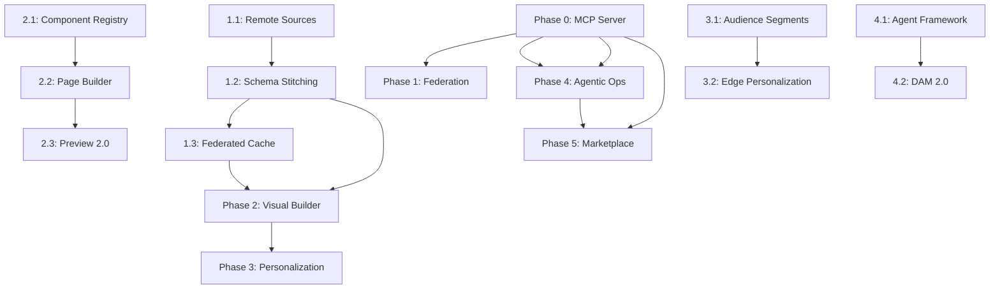

# Rosmarium V3 — Enterprise Content Orchestration Roadmap

> **Version**: 3.0 | **Created**: 2026-06-01 | **Updated**: 2026-06-23 | **Status**: Active
>
> This roadmap elevates Rosmarium from an AI-native Headless CMS (V2) to the **leading
> Enterprise Content Orchestration System (COS)**, addressing Content Federation, Visual
> Experience Orchestration, Edge Personalization, and Agentic AI Operations.
>
> Based on analysis of Hygraph, Uniform, Builder.io, Contentful (acquired by Salesforce),
> Strapi v5, Payload CMS 3.0, Sanity, and the emerging MCP ecosystem (June 2026).

---

## Table of Contents

1. [Executive Summary](#1-executive-summary)
2. [Market Research: The Composable Enterprise (2026)](#2-market-research-the-composable-enterprise-2026)
3. [Rosmarium V2 Competitive Position](#3-rosmarium-v2-competitive-position)
4. [V3 Gap Analysis](#4-v3-gap-analysis)
5. [V3 Architecture Principles](#5-v3-architecture-principles)
6. [Phase 0 — MCP Server & AI Agent Infrastructure](#phase-0--mcp-server--ai-agent-infrastructure-month-1)
7. [Phase 1 — Unified GraphQL Mesh (Content Federation)](#phase-1--unified-graphql-mesh-content-federation-months-2-4)
8. [Phase 2 — Visual Experience Orchestration](#phase-2--visual-experience-orchestration-months-5-7)
9. [Phase 3 — Edge Personalization & Analytics](#phase-3--edge-personalization--analytics-months-8-9)
10. [Phase 4 — Agentic Enterprise Operations](#phase-4--agentic-enterprise-operations-months-10-11)
11. [Phase 5 — Ecosystem & Plugin Marketplace](#phase-5--ecosystem--plugin-marketplace-month-12)
12. [Cross-Cutting Concerns](#cross-cutting-concerns)
13. [Success Metrics](#success-metrics)
14. [Risk Register](#risk-register)

---

## 1. Executive Summary

Rosmarium V2 delivered a **complete AI-native Content Operating System** with 26 gap items
resolved across 6 phases: block editor, workflow engine, plugin system, generative AI
studio, edge delivery, SSO, workspaces, and governance. V2.1 added an intelligent web
ingestion pipeline. The platform is now feature-competitive with Strapi, Payload, and
Directus, and leads the industry in AI-native capabilities (knowledge graph, RAG, hybrid
search, NER, auto-tagging).

**V3 addresses the next frontier: making Rosmarium the enterprise data hub and experience
orchestrator.**

| V2 Strengths (Foundation) | V3 New Capabilities |
|---|---|
| Block Editor + Live Preview | Model Context Protocol (MCP) Server |
| Workflow Engine + Branching | Content Federation (GraphQL Mesh) |
| Plugin System + CLI | Visual Page Builder |
| Generative AI Studio | Edge Personalization Engine |
| Edge Delivery + Media Pipeline | Agentic AI Operations |
| SSO + Workspaces + Governance | Plugin Marketplace & Ecosystem |
| i18n + SDK Integrations | Federated Caching & Remote Sources |
| Web Ingestion Pipeline | Audience Segmentation & A/B Testing |

**Key Strategic Insight**: The CMS market in 2026 has split into two camps:
1. **Data Hubs** (Hygraph) — federate all enterprise data behind one GraphQL API
2. **Visual Hubs** (Builder.io, Uniform) — let marketers compose pages visually

Rosmarium V3 does **both** — unified data federation + visual experience orchestration —
as an open-source, self-hosted platform. No competitor offers this combination.

---

## 2. Market Research: The Composable Enterprise (2026)

### Industry Landscape

Enterprises are moving from monolithic DXPs to composable, best-of-breed stacks. This
creates "stack fragmentation" — dozens of SaaS tools with no unified API layer.

```
2024: Monolithic DXP → Composable MACH Stack
2025: MACH Stack → "MACH Monolith" (too many APIs, no unification)
2026: MACH Monolith → Content Operating System (unified orchestration)
```

### Four Strategic Pillars (2026)

| Pillar | What It Solves | Market Leader | Rosmarium V2 | Rosmarium V3 |
|---|---|---|---|---|
| **Content Federation** | Stack fragmentation — too many APIs | Hygraph | ❌ Own data only | ✅ GraphQL Mesh |
| **Visual Orchestration** | Developer bottleneck for marketers | Builder.io / Uniform | ⚠️ Live Preview only | ✅ Visual Page Builder |
| **Edge Personalization** | One-size-fits-all content | Uniform / Ninetailed | ⚠️ Edge delivery only | ✅ 1:1 personalization |
| **Agentic Operations** | Manual repetitive tasks | Sanity / Cosmic | ⚠️ Generative AI only | ✅ Autonomous agents |
| **MCP Integration** | AI agent ↔ CMS interop standard | Strapi (v5.47 native) | ❌ None | ✅ Native MCP server |

### Competitive Threats

| Competitor | 2026 Move | Impact on Rosmarium |
|---|---|---|
| **Strapi v5.47** | Native MCP server, largest plugin marketplace | Must match MCP + build marketplace |
| **Payload CMS 3.0** | Native Next.js, point-and-click visual editing | Must offer visual editing |
| **Sanity** | Content Agent + MCP server, real-time collab | Must ship MCP server |
| **Hygraph** | Content Federation leader, GraphQL mesh | Must build federation layer |
| **Contentful** | Acquired by Salesforce — enterprise budget + distribution | Must target enterprise features |

---

## 3. Rosmarium V2 Competitive Position

### Where Rosmarium Leads (V2 Strengths)

| Capability | Rosmarium V2 | Industry |
|---|---|---|
| Knowledge Graph + Cypher-lite + Traversal | ✅ Native | ❌ Unique in CMS |
| Hybrid Search (BM25 + pgvector + RRF) | ✅ Native | ⚠️ Basic search |
| RAG Pipeline + Streaming | ✅ Native | ❌ No CMS has native RAG |
| AI Intelligence (NER, tagging, summarization) | ✅ Native | ⚠️ Sanity only |
| Web Ingestion Pipeline | ✅ Native | ❌ Unique |
| Content Branching (Git-like) | ✅ Native | ⚠️ Rare |
| Open Source (Apache 2.0) | ✅ Full | ⚠️ Mixed licensing |

### Where Rosmarium Must Evolve (V3 Targets)

| Capability | Rosmarium V2 | Industry Leaders |
|---|---|---|
| MCP Server | ❌ None | ✅ Strapi (native), Sanity (native) |
| Content Federation | ❌ Own data only | ✅ Hygraph (GraphQL mesh) |
| Visual Page Builder | ❌ Live preview only | ✅ Builder.io, Storyblok, Payload |
| Edge Personalization | ❌ Static edge delivery | ✅ Uniform, Ninetailed |
| Agentic AI Operations | ❌ Generative only | ✅ Sanity Content Agent, Cosmic |
| Plugin Marketplace | ❌ System exists, no registry | ✅ Strapi Marketplace (1000+ plugins) |
| Enterprise DAM | ❌ Basic media upload | ✅ Cloudinary, Imgix integration |

---

## 4. V3 Gap Analysis

### Priority Matrix

```
                    HIGH IMPACT
                        │
    ┌───────────────────┼───────────────────┐
    │                   │                   │
    │  P0: MUST HAVE    │  P1: SHOULD HAVE  │
    │                   │                   │
    │  • MCP Server     │  • Visual Builder │
    │  • GraphQL Fed.   │  • Edge Personal. │
    │  • Remote Sources │  • Audience Segm. │
    │  • Fed. Caching   │  • A/B Testing    │
    │                   │  • DAM 2.0        │
    │                   │                   │
HIGH├───────────────────┼───────────────────┤LOW
FREQ│                   │                   │FREQ
    │  P2: IMPORTANT    │  P3: FUTURE       │
    │                   │                   │
    │  • Agentic Agents │  • GraphQL Feder. │
    │  • Plugin Market  │    (Apollo spec)  │
    │  • Compliance Bot │  • Headless Forms │
    │  • Auto-Localiz.  │  • Multi-DB       │
    │  • Brand Voice AI │  • IoT Channels   │
    │                   │                   │
    └───────────────────┼───────────────────┘
                        │
                    LOW IMPACT
```

### Full Gap Inventory

| # | Gap | Priority | Phase | Complexity |
|---|---|---|---|---|
| G27 | MCP Server (Model Context Protocol) | P0 | 0 | Medium |
| G28 | MCP Tool Registry (CRUD, search, AI ops) | P0 | 0 | Medium |
| G29 | Remote Data Source Registration | P0 | 1 | High |
| G30 | GraphQL Schema Stitching (Pothos-native) | P0 | 1 | Very High |
| G31 | Federated Caching (edge + origin) | P1 | 1 | High |
| G32 | Visual Page Builder | P1 | 2 | Very High |
| G33 | Component Data Binding | P1 | 2 | High |
| G34 | Live Preview 2.0 (Bidirectional) | P1 | 2 | High |
| G35 | Audience Segmentation Engine | P1 | 3 | High |
| G36 | AI-Driven Variant Generation | P1 | 3 | High |
| G37 | Edge Delivery Rules (Personalization) | P1 | 3 | High |
| G38 | Auto-Localization Agents | P2 | 4 | Medium |
| G39 | Compliance & Brand Voice Agents | P2 | 4 | Medium |
| G40 | Enterprise DAM 2.0 | P2 | 4 | High |
| G41 | Plugin Marketplace Registry | P2 | 5 | Medium |
| G42 | Plugin Discovery & Installation UI | P2 | 5 | Medium |
| G43 | Community Contribution Pipeline | P2 | 5 | Low |

---

## 5. V3 Architecture Principles

### Design Tenets

1. **Federation-First** — Rosmarium is the single GraphQL endpoint for ALL enterprise
   data, regardless of where it lives (own DB, Shopify, SAP, legacy APIs)
2. **MCP-Native** — AI agents interact with Rosmarium through the Model Context Protocol,
   not custom integrations. This is the universal "USB-C port" for AI.
3. **Marketer Autonomy** — Visual page builder + component data binding eliminates
   developer bottleneck for routine content operations
4. **Edge Intelligence** — Personalization decisions happen at the CDN edge,
   not the origin server — sub-50ms personalized responses
5. **Agentic, Not Assistive** — AI agents execute multi-step workflows autonomously
   (with governance guardrails), not just answer prompts
6. **Open Ecosystem** — Plugin marketplace, community contributions, self-hosted

### Architecture Evolution (V2 → V3)

```
                      Rosmarium V3 Architecture
    ┌──────────────────────────────────────────────────┐
    │                 MCP Server Layer                  │
    │  ┌──────────┐  ┌──────────┐  ┌───────────────┐  │
    │  │ Content   │  │ Schema   │  │ AI Operations │  │
    │  │ Tools     │  │ Tools    │  │ Tools         │  │
    │  └──────────┘  └──────────┘  └───────────────┘  │
    └──────────────────────┬───────────────────────────┘
                           │
    ┌──────────────────────┴───────────────────────────┐
    │              Edge Personalization                  │
    │  ┌──────────┐  ┌──────────┐  ┌───────────────┐  │
    │  │ Audience  │  │ Variant  │  │ Personalized  │  │
    │  │ Segments  │  │ Selector │  │ Edge Cache    │  │
    │  └──────────┘  └──────────┘  └───────────────┘  │
    └──────────────────────┬───────────────────────────┘
                           │
    ┌──────────────────────┴───────────────────────────┐
    │          Unified GraphQL Mesh (Federation)        │
    │  ┌──────────┐  ┌──────────┐  ┌───────────────┐  │
    │  │ Rosmarium│  │ Remote   │  │ Federated     │  │
    │  │ Schema   │  │ Sources  │  │ Cache         │  │
    │  │ (Pothos) │  │ (REST/GQL)│ │ (per-source)  │  │
    │  └──────────┘  └──────────┘  └───────────────┘  │
    └──────────────────────┬───────────────────────────┘
                           │
    ┌──────────────────────┴───────────────────────────┐
    │        Visual Experience Orchestration             │
    │  ┌──────────┐  ┌──────────┐  ┌───────────────┐  │
    │  │ Page     │  │ Component│  │ Bidirectional │  │
    │  │ Builder  │  │ Registry │  │ Preview       │  │
    │  └──────────┘  └──────────┘  └───────────────┘  │
    └──────────────────────┬───────────────────────────┘
                           │
    ┌──────────────────────┴───────────────────────────┐
    │          Agentic Operations Layer                  │
    │  ┌──────────┐  ┌──────────┐  ┌───────────────┐  │
    │  │ Localiz. │  │ Complian.│  │ Brand Voice   │  │
    │  │ Agent    │  │ Agent    │  │ Agent         │  │
    │  └──────────┘  └──────────┘  └───────────────┘  │
    └──────────────────────┬───────────────────────────┘
                           │
    ┌──────────────────────┴───────────────────────────┐
    │            Existing V2 Core (Preserved)           │
    │  Content Engine │ Workflow │ AI Intelligence      │
    │  Knowledge Graph│ Plugins  │ Branching            │
    │  SSO + RBAC     │ i18n     │ Edge Delivery        │
    └──────────────────────────────────────────────────┘
```

---

## Phase 0 — MCP Server & AI Agent Infrastructure (Month 1)

> **Goal**: Make Rosmarium the best AI-agent-accessible CMS by implementing a native
> Model Context Protocol server. This is the #1 competitive gap — Strapi ships native
> MCP since v5.47, Sanity has a Content Agent with MCP. Without this, Rosmarium cannot
> claim to be "AI-native."

### Task 0.1: MCP Server Core

**What**: Implement an MCP server that exposes Rosmarium's content, schemas, and AI
operations as MCP tools, compatible with Claude Desktop, Cursor, VS Code, Windsurf,
and any MCP-compatible AI host.

**Why**: MCP is the 2026 standard for AI-CMS integration. It replaces fragile custom
API integrations with a universal protocol. "Build once, work with every AI agent."

**Technical Specification**:

```typescript
// New file: apps/rosmarium-server/src/mcp/server.ts

import { McpServer } from "@modelcontextprotocol/sdk/server/mcp.js";
import { StdioServerTransport } from "@modelcontextprotocol/sdk/server/stdio.js";

const server = new McpServer({
  name: "rosmarium",
  version: "3.0.0",
});

// Content Tools
server.tool("content_list", "List content entries with filtering", schema, handler);
server.tool("content_get", "Get a content entry by ID", schema, handler);
server.tool("content_create", "Create a new content entry", schema, handler);
server.tool("content_update", "Update a content entry", schema, handler);
server.tool("content_delete", "Delete a content entry", schema, handler);
server.tool("content_publish", "Publish a content entry", schema, handler);
server.tool("content_unpublish", "Unpublish a content entry", schema, handler);

// Schema Tools
server.tool("schema_list", "List all content type schemas", schema, handler);
server.tool("schema_get", "Get a content type schema definition", schema, handler);

// Search Tools
server.tool("search_hybrid", "Hybrid BM25+vector search", schema, handler);
server.tool("search_graph", "Graph traversal query", schema, handler);

// AI Tools
server.tool("ai_summarize", "Summarize a content entry", schema, handler);
server.tool("ai_tag", "Auto-tag a content entry", schema, handler);
server.tool("ai_translate", "Translate content to target locale", schema, handler);
server.tool("ai_generate", "Generate content from prompt", schema, handler);

// Resources (read-only context)
server.resource("content-types", "All content type definitions");
server.resource("locales", "Available locales and fallback chains");
server.resource("workflows", "Workflow definitions and states");
```

**Implementation**:

| File | Action | Details |
|---|---|---|
| `apps/rosmarium-server/src/mcp/server.ts` | NEW | MCP server with stdio transport |
| `apps/rosmarium-server/src/mcp/tools/content.ts` | NEW | Content CRUD tools |
| `apps/rosmarium-server/src/mcp/tools/schema.ts` | NEW | Schema inspection tools |
| `apps/rosmarium-server/src/mcp/tools/search.ts` | NEW | Search and graph tools |
| `apps/rosmarium-server/src/mcp/tools/ai.ts` | NEW | AI operation tools |
| `apps/rosmarium-server/src/mcp/resources/` | NEW | MCP resources (content types, locales) |
| `apps/rosmarium-server/src/mcp/auth.ts` | NEW | API key authentication for MCP connections |
| `apps/rosmarium-cli/src/commands/mcp.ts` | NEW | `rosmarium mcp start` command |
| `package.json` | MODIFY | Add `@modelcontextprotocol/sdk` dependency |

**MCP Connection Modes**:
```
1. Stdio (local): rosmarium mcp start → AI desktop clients
2. SSE (remote): POST /api/mcp/sse → AI cloud agents
3. WebSocket (future): for streaming bidirectional comms
```

**Acceptance Criteria**:
- [ ] MCP server starts via `rosmarium mcp start` CLI command
- [ ] All content CRUD operations exposed as MCP tools
- [ ] Schema inspection tools (list types, get type definition)
- [ ] Hybrid search and graph traversal tools
- [ ] AI operations (summarize, tag, translate, generate) as tools
- [ ] API key authentication for MCP connections
- [ ] RBAC enforcement — MCP tools respect user permissions
- [ ] Resources: content type schemas, locales, workflow definitions
- [ ] Works with Claude Desktop, Cursor, and VS Code MCP clients
- [ ] Tenant-aware — `X-Tenant-Id` propagated through MCP context
- [ ] Tests: 20+ (tool execution, auth, RBAC, error handling)

### Task 0.2: MCP Plugin Extension Point

**What**: Allow plugins to register custom MCP tools via the existing plugin system.

**Why**: The plugin architecture (V2 G09) already supports custom routes and field types.
Extending it to MCP tools enables ecosystem-driven AI capabilities.

**Implementation**:

| File | Action | Details |
|---|---|---|
| `packages/types/src/plugin.ts` | MODIFY | Add `mcpTools` to `RosmariumPlugin` interface |
| `apps/rosmarium-server/src/mcp/plugin-bridge.ts` | NEW | Register plugin MCP tools at startup |

```typescript
// Plugin MCP extension
interface RosmariumPlugin {
  // ... existing hooks, routes, fieldTypes ...

  // NEW: MCP tools
  mcpTools?: McpToolDefinition[];
}

interface McpToolDefinition {
  name: string;
  description: string;
  inputSchema: ZodSchema;
  handler: (args: unknown, ctx: McpContext) => Promise<McpToolResult>;
}
```

**Acceptance Criteria**:
- [ ] Plugins can register custom MCP tools
- [ ] Plugin MCP tools inherit RBAC from plugin config
- [ ] Example plugin: `@rosmarium/plugin-seo` registers `seo_audit` MCP tool
- [ ] Tests: 10+ (plugin tool registration, execution, isolation)

---

## Phase 1 — Unified GraphQL Mesh (Content Federation) (Months 2-4)

> **Goal**: Make Rosmarium the single source of truth for ALL enterprise data,
> regardless of where it lives. Query Shopify products, SAP inventory, and Rosmarium
> blog posts in a single GraphQL request.

### Month 2: Remote Data Source System (G29)

#### Task 1.1: Remote Source Registration

**What**: Build a system to register external REST and GraphQL APIs as "remote sources"
that become queryable through Rosmarium's unified GraphQL endpoint.

**Why**: Enterprises use 20+ SaaS tools. Hygraph's content federation is their #1
differentiator. Rosmarium must offer this to compete in enterprise markets.

**Technical Specification**:

```typescript
// New file: packages/types/src/federation.ts

interface RemoteSource {
  id: string;
  name: string;              // e.g., "shopify", "stripe", "legacy-pim"
  type: 'graphql' | 'rest' | 'openapi';
  endpoint: string;          // Remote API URL
  auth: RemoteSourceAuth;
  schema?: {                 // For REST/OpenAPI sources
    introspectionUrl?: string;
    openApiSpec?: string;    // URL or inline spec
  };
  cacheConfig: {
    ttl: number;             // Default TTL in seconds
    staleWhileRevalidate: boolean;
    invalidationWebhook?: string;
  };
  fieldMappings?: FieldMapping[];  // Map remote fields to Rosmarium types
  rateLimiting: {
    maxRequestsPerMinute: number;
    burstSize: number;
  };
  status: 'active' | 'paused' | 'error';
  healthCheckUrl?: string;
}

type RemoteSourceAuth =
  | { type: 'apiKey'; header: string; key: string }
  | { type: 'bearer'; token: string }
  | { type: 'oauth2'; clientId: string; clientSecret: string; tokenUrl: string }
  | { type: 'none' };
```

**Implementation**:

| File | Action | Details |
|---|---|---|
| `packages/types/src/federation.ts` | NEW | Federation type definitions |
| `apps/rosmarium-server/src/db/schema/remote-sources.ts` | NEW | `remote_sources` table |
| `apps/rosmarium-server/src/modules/federation/source.service.ts` | NEW | Source CRUD, health checks |
| `apps/rosmarium-server/src/modules/federation/source.routes.ts` | NEW | Admin API for source management |
| `apps/rosmarium-admin/src/pages/Federation.tsx` | NEW | Remote source management UI |
| DB migration | NEW | `remote_sources`, `remote_source_cache` tables |

**Database Schema**:
```sql
CREATE TABLE remote_sources (
  id TEXT PRIMARY KEY,
  name VARCHAR(255) NOT NULL UNIQUE,
  type VARCHAR(20) NOT NULL,         -- 'graphql', 'rest', 'openapi'
  endpoint TEXT NOT NULL,
  auth_config JSONB NOT NULL DEFAULT '{}',
  cache_config JSONB NOT NULL DEFAULT '{"ttl": 300}',
  rate_limit_config JSONB NOT NULL DEFAULT '{"maxRequestsPerMinute": 60}',
  field_mappings JSONB DEFAULT '[]',
  status VARCHAR(20) NOT NULL DEFAULT 'active',
  health_check_url TEXT,
  last_health_check TIMESTAMPTZ,
  last_health_status VARCHAR(20),
  introspected_schema JSONB,          -- Cached remote schema
  tenant_id TEXT REFERENCES tenants(id),
  created_at TIMESTAMPTZ NOT NULL DEFAULT now(),
  updated_at TIMESTAMPTZ NOT NULL DEFAULT now()
);
```

**Acceptance Criteria**:
- [ ] Register GraphQL remote sources with auto-introspection
- [ ] Register REST/OpenAPI remote sources with schema generation
- [ ] Auth support: API key, Bearer token, OAuth 2.0 client credentials
- [ ] Health check monitoring with status tracking
- [ ] Rate limiting per source to prevent upstream abuse
- [ ] Admin UI: source CRUD with connection testing
- [ ] Tenant-scoped sources (each tenant configures their own)
- [ ] Tests: 15+ (registration, auth, health checks, rate limiting)

### Month 3: GraphQL Schema Stitching (G30)

#### Task 1.2: Pothos-Native Schema Stitching

**What**: Stitch remote source schemas into Rosmarium's Pothos GraphQL schema,
allowing unified queries across local and remote data.

**Why**: Must be Pothos-native (not Apollo Federation gateway) to avoid an additional
service and leverage existing schema builder infrastructure.

**Technical Specification**:

```typescript
// Query example after stitching:
const query = `
  query ProductPage($slug: String!, $locale: String!) {
    # From Rosmarium (local)
    article(slug: $slug, locale: $locale) {
      title
      body
      author { name }
    }
    # From Shopify (remote, stitched)
    shopify_product(handle: $slug) {
      title
      price
      variants { title sku }
    }
    # From Stripe (remote, stitched)
    stripe_prices(product: $slug, active: true) {
      unit_amount
      currency
    }
  }
`;
```

**Implementation**:

| File | Action | Details |
|---|---|---|
| `apps/rosmarium-server/src/modules/federation/stitcher.ts` | NEW | Schema stitching engine |
| `apps/rosmarium-server/src/modules/federation/remote-executor.ts` | NEW | Execute queries against remote sources |
| `apps/rosmarium-server/src/modules/federation/schema-transform.ts` | NEW | Namespace remote types (prefix with source name) |
| `apps/rosmarium-server/src/modules/federation/rest-to-graphql.ts` | NEW | Convert REST/OpenAPI to GraphQL schema |
| `apps/rosmarium-server/src/graphql/index.ts` | MODIFY | Merge stitched schemas into main schema |

**Acceptance Criteria**:
- [ ] GraphQL remote sources stitched via introspection
- [ ] REST/OpenAPI sources converted to GraphQL types automatically
- [ ] Remote types namespaced to prevent collisions (e.g., `shopify_Product`)
- [ ] Cross-source queries in single request
- [ ] Error isolation — remote source failure doesn't crash local queries
- [ ] Query delegation — only fields requested from remote sources trigger fetches
- [ ] Admin UI: schema browser showing local + remote types
- [ ] Tests: 20+ (stitching, delegation, error handling, namespacing)

### Month 4: Federated Caching (G31)

#### Task 1.3: Smart Federated Cache

**What**: Implement per-source caching that prevents rate-limiting from external
systems while keeping data fresh.

**Implementation**:

| File | Action | Details |
|---|---|---|
| `apps/rosmarium-server/src/modules/federation/cache.service.ts` | NEW | Per-source cache with TTL |
| `apps/rosmarium-server/src/modules/federation/invalidation.ts` | NEW | Webhook-based invalidation from remote sources |
| `apps/rosmarium-edge/src/federation-cache.ts` | NEW | Edge-level federation cache |

**Caching Strategy**:
```
Federated Query → Edge Cache (per-source TTL)
  ├── HIT → Return merged result (<10ms)
  └── MISS → Per-source parallel fetch
       ├── Rosmarium (local DB, <50ms)
       ├── Shopify (remote, cached if TTL valid)
       ├── Stripe (remote, cached if TTL valid)
       └── Merge results + cache at edge
```

**Acceptance Criteria**:
- [ ] Per-source configurable TTL (5s to 24hr)
- [ ] Stale-while-revalidate for high availability
- [ ] Webhook-triggered invalidation from remote sources
- [ ] Cache hit/miss metrics exposed via admin dashboard
- [ ] Edge-level caching for federated queries
- [ ] Rate limit protection — cache absorbs traffic spikes
- [ ] Tests: 10+ (TTL, invalidation, stale-while-revalidate)

---

## Phase 2 — Visual Experience Orchestration (Months 5-7)

> **Goal**: Bridge the gap between developer components and marketer autonomy.
> Let non-technical users compose pages visually using developer-built components
> bound to federated data.

### Month 5: Component Registry & Page Model

#### Task 2.1: Component Registry

**What**: A system for developers to register frontend components (React, Vue, Astro)
that content editors can use in the visual page builder.

**Technical Specification**:

```typescript
// New file: packages/types/src/visual-builder.ts

interface ComponentDefinition {
  id: string;
  name: string;                    // e.g., "HeroBanner"
  category: string;                // e.g., "Marketing", "Layout"
  description: string;
  thumbnail?: string;              // Preview image
  props: ComponentProp[];          // Configurable properties
  defaultProps: Record<string, unknown>;
  variants?: ComponentVariant[];   // Pre-configured variants
  framework: 'react' | 'vue' | 'astro' | 'html';
  source: string;                  // npm package or file path
}

interface ComponentProp {
  name: string;
  type: 'text' | 'richText' | 'image' | 'number' | 'boolean'
    | 'select' | 'color' | 'relation' | 'federated';  // NEW: federated data binding
  label: string;
  required: boolean;
  defaultValue?: unknown;
  dataBinding?: {
    source: string;              // Remote source name or "rosmarium"
    query: string;               // GraphQL query fragment
    variableMapping: Record<string, string>;  // Map page context to query variables
  };
}

interface PageDefinition {
  id: string;
  slug: string;
  title: string;
  locale: string;
  template?: string;
  sections: PageSection[];
  seo: {
    title: string;
    description: string;
    ogImage?: string;
  };
  personalization?: PersonalizationRule[];
}

interface PageSection {
  id: string;
  componentId: string;
  props: Record<string, unknown>;
  conditions?: PersonalizationCondition[];  // Show/hide based on audience
  order: number;
}
```

**Implementation**:

| File | Action | Details |
|---|---|---|
| `packages/types/src/visual-builder.ts` | NEW | Component and page type definitions |
| `apps/rosmarium-server/src/db/schema/pages.ts` | NEW | `pages`, `page_sections`, `components` tables |
| `apps/rosmarium-server/src/modules/pages/component.service.ts` | NEW | Component registry CRUD |
| `apps/rosmarium-server/src/modules/pages/page.service.ts` | NEW | Page composition service |
| `apps/rosmarium-server/src/modules/pages/page.routes.ts` | NEW | REST + GraphQL endpoints |
| DB migration | NEW | Pages and components tables |

**Acceptance Criteria**:
- [ ] Register components with prop definitions and data bindings
- [ ] Component categories for organized browsing
- [ ] Component variant system (same component, different configurations)
- [ ] Data binding to local Rosmarium content and federated remote sources
- [ ] Page model with ordered sections, SEO, and personalization rules
- [ ] Admin UI: component browser with thumbnails and previews
- [ ] Tests: 15+ (registration, page composition, data binding)

### Month 6-7: Visual Page Builder UI (G32, G33, G34)

#### Task 2.2: Drag-and-Drop Page Builder

**What**: A visual interface where marketers compose pages by dragging registered
components, configuring props, and binding data — without writing code.

**Implementation**:

| File | Action | Details |
|---|---|---|
| `apps/rosmarium-admin/src/pages/PageBuilder.tsx` | NEW | Main page builder interface |
| `apps/rosmarium-admin/src/components/builder/Canvas.tsx` | NEW | Drop zone canvas |
| `apps/rosmarium-admin/src/components/builder/ComponentPalette.tsx` | NEW | Component browser sidebar |
| `apps/rosmarium-admin/src/components/builder/PropEditor.tsx` | NEW | Property editor panel |
| `apps/rosmarium-admin/src/components/builder/DataBinder.tsx` | NEW | Visual data binding UI |
| `apps/rosmarium-admin/src/components/builder/DevicePreview.tsx` | NEW | Responsive preview (desktop/tablet/mobile) |

#### Task 2.3: Live Preview 2.0 — Bidirectional Sync (G34)

**What**: Upgrade the V2 live preview to support bidirectional sync — clicking an
element in the preview opens the relevant field in the CMS editor.

**Implementation**:

| File | Action | Details |
|---|---|---|
| `packages/sdk/src/preview-v2.ts` | NEW | Bidirectional preview protocol |
| `apps/rosmarium-admin/src/components/preview/BidirectionalPreview.tsx` | NEW | Click-to-edit preview |

**Preview 2.0 Protocol**:
```
Admin Editor ←→ Frontend Preview
  │                    │
  ├── field change ───►│ (forward: real-time preview update)
  │                    │
  │◄── element click ──┤ (reverse: highlight + focus CMS field)
  │                    │
  ├── section add  ───►│ (forward: hot-insert section)
  │                    │
  │◄── drag reorder ───┤ (reverse: reorder sections in CMS)
```

**Acceptance Criteria**:
- [ ] Drag-and-drop page composition from component palette
- [ ] Visual prop editing with real-time preview
- [ ] Data binding to Rosmarium content and federated sources
- [ ] Responsive preview toggle (desktop, tablet, mobile)
- [ ] Bidirectional preview: click element → focus CMS field
- [ ] Section reordering via drag in both admin and preview
- [ ] Undo/redo with keyboard shortcuts (Ctrl+Z/Y)
- [ ] Page versioning and publishing workflow integration
- [ ] Tests: 20+ (composition, data binding, preview protocol)

---

## Phase 3 — Edge Personalization & Analytics (Months 8-9)

> **Goal**: Deliver 1:1 tailored content without sacrificing performance. Sub-50ms
> personalized responses from the edge, not the origin.

### Month 8: Audience Segmentation Engine (G35)

#### Task 3.1: Audience & Segment System

**What**: Define user segments based on traits (geography, device, behavior, custom
attributes) and serve different content to each segment.

**Technical Specification**:

```typescript
// New file: packages/types/src/personalization.ts

interface AudienceSegment {
  id: string;
  name: string;               // e.g., "US Mobile Users", "Returning Visitors"
  description: string;
  conditions: SegmentCondition[];
  logic: 'and' | 'or';
  priority: number;            // Higher priority segments evaluated first
}

interface SegmentCondition {
  trait: string;               // geo.country, device.type, behavior.visits, custom.*
  operator: 'eq' | 'neq' | 'in' | 'gt' | 'lt' | 'contains' | 'regex';
  value: unknown;
}

interface ContentVariant {
  id: string;
  baseEntryId: string;        // Original content entry
  segmentId: string;          // Target audience segment
  overrides: Record<string, unknown>;  // Field-level overrides
  metrics: {
    impressions: number;
    clicks: number;
    conversions: number;
  };
}
```

**Implementation**:

| File | Action | Details |
|---|---|---|
| `packages/types/src/personalization.ts` | NEW | Personalization types |
| `apps/rosmarium-server/src/db/schema/personalization.ts` | NEW | `segments`, `variants`, `impressions` tables |
| `apps/rosmarium-server/src/modules/personalization/segment.service.ts` | NEW | Segment CRUD, evaluation |
| `apps/rosmarium-server/src/modules/personalization/variant.service.ts` | NEW | Variant management |
| `apps/rosmarium-server/src/modules/personalization/personalization.routes.ts` | NEW | REST endpoints |
| `apps/rosmarium-admin/src/pages/Personalization.tsx` | NEW | Segment builder UI |
| DB migration | NEW | Personalization tables |

**Acceptance Criteria**:
- [ ] Define audience segments with multi-condition rules
- [ ] Create content variants per segment (field-level overrides)
- [ ] Segment evaluation engine with trait matching
- [ ] Admin UI: visual segment builder with AND/OR logic
- [ ] Admin UI: variant editor showing base vs. override per field
- [ ] Impression/click/conversion tracking per variant
- [ ] A/B testing mode: random split between variants with statistical significance
- [ ] Tests: 15+ (segment evaluation, variant resolution, metrics)

### Month 9: Edge Personalization Rules (G37)

#### Task 3.2: Edge-Level Personalization

**What**: Push personalization decisions to the Cloudflare Worker edge, serving
personalized content directly from edge cache without hitting origin.

**Implementation**:

| File | Action | Details |
|---|---|---|
| `apps/rosmarium-edge/src/personalization.ts` | NEW | Edge segment evaluation |
| `apps/rosmarium-edge/src/traits.ts` | NEW | Extract user traits from request |
| `apps/rosmarium-edge/src/variant-cache.ts` | NEW | Per-segment edge cache partitioning |

**Edge Personalization Flow**:
```
User Request → Cloudflare Worker
  ├── Extract traits (geo from CF headers, device from UA, JWT claims)
  ├── Evaluate segments (rules pre-synced to edge KV)
  ├── Select variant (segment match → variant ID)
  ├── Serve from edge cache (per-variant cache key)
  │   ├── HIT → Return personalized content (<10ms)
  │   └── MISS → Fetch from origin with variant context
  └── Track impression (async, non-blocking)
```

**Acceptance Criteria**:
- [ ] Trait extraction: geo (Cloudflare headers), device (User-Agent), custom (JWT/cookie)
- [ ] Segment rules synced to edge KV for zero-latency evaluation
- [ ] Per-segment cache partitioning (separate cache keys per variant)
- [ ] p95 < 50ms for personalized responses from edge
- [ ] Impression tracking via async beacon (non-blocking)
- [ ] A/B test assignment via deterministic hashing (consistent user experience)
- [ ] Admin dashboard: personalization analytics (impressions, CTR, conversions per segment)
- [ ] Tests: 15+ (trait extraction, segment evaluation, cache partitioning)

---

## Phase 4 — Agentic Enterprise Operations (Months 10-11)

> **Goal**: Replace human content managers for repetitive compliance, localization,
> and quality tasks with autonomous AI agents that execute multi-step workflows.

### Month 10: Autonomous Agent Framework (G38, G39)

#### Task 4.1: Agent Task System

**What**: A task-based agent execution framework where AI agents receive goals,
plan multi-step workflows, and execute them with governance guardrails.

**Technical Specification**:

```typescript
// New file: packages/types/src/agents.ts

interface AgentTask {
  id: string;
  type: 'localization' | 'compliance' | 'brand-voice' | 'seo-audit' | 'rot-cleanup';
  status: 'pending' | 'planning' | 'executing' | 'review' | 'completed' | 'failed';
  goal: string;                    // Natural language goal
  plan?: AgentStep[];              // AI-generated execution plan
  results: AgentStepResult[];
  requiresHumanReview: boolean;    // Governance gate
  createdBy: string;               // User who triggered or schedule ID
  tenantId: string;
  startedAt?: Date;
  completedAt?: Date;
}

interface AgentStep {
  id: string;
  action: string;                  // MCP tool to call
  args: Record<string, unknown>;   // Tool arguments
  dependsOn?: string[];            // Previous step IDs
  status: 'pending' | 'running' | 'completed' | 'failed' | 'skipped';
}
```

**Implementation**:

| File | Action | Details |
|---|---|---|
| `packages/types/src/agents.ts` | NEW | Agent task types |
| `apps/rosmarium-server/src/db/schema/agent-tasks.ts` | NEW | `agent_tasks`, `agent_steps` tables |
| `apps/rosmarium-server/src/modules/agents/agent.service.ts` | NEW | Task lifecycle management |
| `apps/rosmarium-server/src/modules/agents/planner.ts` | NEW | AI-powered step planning |
| `apps/rosmarium-server/src/modules/agents/executor.ts` | NEW | Step execution via MCP tools |
| `apps/rosmarium-server/src/modules/agents/agent.routes.ts` | NEW | Agent task API |
| `apps/rosmarium-admin/src/pages/Agents.tsx` | NEW | Agent task dashboard |
| DB migration | NEW | Agent task tables |

**Built-in Agent Types**:

| Agent | Goal | MCP Tools Used |
|---|---|---|
| **Auto-Localization** | Translate all content to target locales on publish | `content_get`, `ai_translate`, `content_update` |
| **Compliance Scanner** | Scan graph for ROT content and flag issues | `search_hybrid`, `ai_summarize`, `content_update` |
| **Brand Voice Auditor** | Check all new content matches brand guidelines | `content_list`, `ai_generate` (evaluation), `content_update` |
| **SEO Optimizer** | Audit and fix SEO metadata across the content graph | `content_list`, `ai_generate` (SEO), `content_update` |

**Acceptance Criteria**:
- [ ] Agent task creation with natural language goals
- [ ] AI-powered step planning (LLM generates execution plan)
- [ ] Step-by-step execution using MCP tools (dogfooding the MCP server)
- [ ] Human-in-the-loop review gate (configurable per agent type)
- [ ] Automatic scheduling (cron-based recurring tasks)
- [ ] Admin UI: task dashboard with step timeline and status
- [ ] All agent operations logged in AI governance audit trail
- [ ] Per-tenant agent budgets (token limits, task limits)
- [ ] Tests: 20+ (planning, execution, governance, error recovery)

### Month 11: Enterprise DAM 2.0 (G40)

#### Task 4.2: Advanced Media Management

**What**: Extend the V2 media pipeline with auto-transcoding, AI-powered tagging,
and advanced asset management.

**Implementation**:

| File | Action | Details |
|---|---|---|
| `apps/rosmarium-server/src/modules/media/dam.service.ts` | NEW | Enhanced DAM with collections, tags |
| `apps/rosmarium-server/src/modules/media/video-processing.ts` | NEW | Video transcoding (HLS/DASH) |
| `apps/rosmarium-ai-worker/src/rosmarium_ai_worker/media/` | NEW | AI media analysis |
| `apps/rosmarium-admin/src/pages/MediaLibrary.tsx` | NEW | Enhanced media library UI |

**Acceptance Criteria**:
- [ ] Media collections and folders
- [ ] AI auto-tagging of images (scene, object, color detection)
- [ ] AI alt-text generation for accessibility
- [ ] Video transcoding to HLS/DASH for adaptive streaming
- [ ] Focal point editor in admin UI
- [ ] Usage tracking — which entries use which assets
- [ ] Bulk media operations (tag, move, delete)
- [ ] Tests: 15+ (DAM operations, AI tagging, video processing)

---

## Phase 5 — Ecosystem & Plugin Marketplace (Month 12)

> **Goal**: Transform Rosmarium from a product into a platform by creating a
> discoverable, installable plugin ecosystem.

### Task 5.1: Plugin Registry & Marketplace (G41, G42)

**What**: A public registry where developers publish plugins and users discover,
install, and manage them — similar to Strapi Marketplace.

**Implementation**:

| File | Action | Details |
|---|---|---|
| `apps/rosmarium-server/src/modules/marketplace/registry.service.ts` | NEW | Plugin registry with search |
| `apps/rosmarium-server/src/modules/marketplace/install.service.ts` | NEW | Plugin installation lifecycle |
| `apps/rosmarium-server/src/modules/marketplace/marketplace.routes.ts` | NEW | Marketplace API |
| `apps/rosmarium-admin/src/pages/Marketplace.tsx` | NEW | Plugin marketplace UI |
| `apps/rosmarium-cli/src/commands/plugin.ts` | MODIFY | `rosmarium plugin search/install/publish` |

**Acceptance Criteria**:
- [ ] Public plugin registry API (list, search, detail, download stats)
- [ ] Admin UI: marketplace browser with categories, ratings, install counts
- [ ] One-click install from admin UI or `rosmarium plugin install <name>`
- [ ] Plugin publishing via `rosmarium plugin publish`
- [ ] Plugin verification/review pipeline (community + official)
- [ ] Compatibility checks (Rosmarium version, dependency resolution)
- [ ] Official starter plugins shipped:
  - [ ] `@rosmarium/plugin-seo` — SEO fields, sitemap, robots.txt
  - [ ] `@rosmarium/plugin-redirects` — URL redirect management
  - [ ] `@rosmarium/plugin-analytics` — content analytics integration
  - [ ] `@rosmarium/plugin-shopify` — Shopify federation connector
- [ ] Tests: 15+ (registry, installation, publishing, compatibility)

---

## Cross-Cutting Concerns

### Documentation

Each phase must include:
- [ ] Updated API documentation (OpenAPI/Swagger) for new endpoints
- [ ] Updated GraphQL schema documentation for federation + page builder
- [ ] User guides in `apps/rosmarium-www/src/content/docs/`
- [ ] MCP server setup guide for AI agent users
- [ ] Federation cookbook with Shopify, Stripe, SAP examples
- [ ] Visual page builder tutorial for non-technical users
- [ ] Migration guide from V2 to V3

### Testing Standards

| Type | Tool | Coverage Target |
|---|---|---|
| Unit Tests | Vitest (TS), pytest (Python) | 80%+ line coverage |
| Integration Tests | Vitest + PostgreSQL/Redis containers | All API endpoints |
| E2E Tests | Playwright | Critical user flows + page builder |
| Load Tests | k6 | p95 < 500ms at 500 concurrent users |
| Federation Tests | Mock remote sources | Error isolation, cache, stitching |
| MCP Tests | MCP client SDK | All tools, auth, RBAC |
| Type Safety | `tsc --noEmit`, `mypy --strict` | Zero errors |
| Linting | ESLint + @typescript-eslint, Ruff | Zero warnings |

### Backward Compatibility

- All V2 APIs continue to work unchanged
- MCP server is opt-in (disabled by default, enabled in config)
- Federation is additive — existing local-only queries unaffected
- Page builder is a new module — does not affect existing content engine
- Edge personalization extends existing edge worker

### Performance Budgets

| Metric | Target |
|---|---|
| Local content API p95 | < 100ms (origin), < 50ms (edge) |
| Federated query p95 (2 sources) | < 300ms (origin), < 100ms (edge cached) |
| Personalized edge response p95 | < 50ms |
| Page builder save + preview | < 500ms |
| MCP tool execution p95 | < 200ms |
| Search API p95 | < 200ms (hybrid), < 50ms (fulltext) |

---

## Success Metrics

### V3.0 Release Criteria

| Category | Metric | Target |
|---|---|---|
| **MCP** | MCP tools | 15+ (content, schema, search, AI) |
| **MCP** | Compatible AI hosts tested | 3+ (Claude, Cursor, VS Code) |
| **Federation** | Remote source types | 3 (GraphQL, REST, OpenAPI) |
| **Federation** | Federated query p95 | < 300ms (2 sources) |
| **Visual** | Page builder components | 10+ registered |
| **Visual** | Bidirectional preview | Working click-to-edit |
| **Personalization** | Edge personalization p95 | < 50ms |
| **Personalization** | A/B test support | Statistical significance calculation |
| **Agents** | Built-in agent types | 4+ (localize, comply, SEO, brand) |
| **Ecosystem** | Marketplace plugins | 4+ official plugins |
| **Quality** | Test count | 700+ (up from ~500) |
| **Quality** | Test coverage | 80%+ |

---

## Risk Register

| # | Risk | Impact | Probability | Mitigation |
|---|---|---|---|---|
| R1 | MCP SDK instability (protocol still evolving) | High | Medium | Pin SDK version; abstract behind adapter layer |
| R2 | GraphQL stitching performance with many remote sources | High | Medium | Per-source caching; parallel execution; circuit breaker pattern |
| R3 | Visual page builder complexity delays Phase 2 | High | High | Start with section-level composition only; add fine-grained editing in V3.1 |
| R4 | Edge personalization cache explosion (too many variants) | Medium | Medium | Limit variant count per page; LRU eviction; hash-based cache keys |
| R5 | Agentic AI agents take unintended actions | High | Medium | Human-in-the-loop review gates; dry-run mode; strict RBAC; audit trail |
| R6 | Remote source downtime breaks federated queries | Medium | High | Circuit breaker; graceful degradation (return local data + error for remote) |
| R7 | Plugin marketplace security (malicious plugins) | High | Low | Code review for official plugins; sandboxed execution; permission declarations |
| R8 | Federation + personalization interaction complexity | Medium | Medium | Keep them orthogonal; personalization operates on resolved (post-federation) data |

---

## Implementation Order & Dependencies



---

## Open Questions — Resolved

| # | Question | Decision | Rationale |
|---|---|---|---|
| 1 | Federation vs Visual Editing first? | **Federation first** (Phase 1) | Hygraph proves backend data unification unlocks all frontend innovation. Visual editing without federated data is a partial solution. Federation enables richer data binding in the page builder. |
| 2 | Apollo Federation v2 or custom stitching? | **Custom Pothos-native stitching** | Apollo Federation requires a gateway service and tight coupling to Apollo. Rosmarium already uses Pothos v4 + graphql-yoga — build a native Remote Source system that stitches external schemas at the Pothos level for zero-overhead, single-process integration. |
| 3 | E-commerce platforms to target first? | **Shopify → Stripe → BigCommerce** | Shopify has the largest market share in composable commerce (60%+ of headless e-commerce). Stripe for payment/subscription data federation. BigCommerce for enterprise B2B. Ship as official marketplace plugins. |

---

## Agent Execution Notes

> **For AI agents (Claude, Antigravity) executing this roadmap:**

1. **Always check `AGENTS.md`** before starting any task for project-specific conventions
2. **Database changes**: Update Drizzle schema in `apps/rosmarium-server/src/db/schema/`,
   then run `pnpm db:generate`
3. **TypeScript conventions**: Strict typing, `.js` extensions for Node.js ESM imports
4. **Python conventions**: Strict typing, mypy, Ruff linting
5. **React conventions**: Functional components, hooks, MUI v9
   (`size={{ xs: 12 }}` not `xs={12}`)
6. **Testing**: Co-locate tests (`*.test.ts`), run `pnpm test` after each change
7. **Each task is independently executable** — complete one task fully (code + tests + docs)
   before moving to the next
8. **Verify after each task**: `pnpm typecheck && pnpm lint && pnpm test`
9. **Git conventions**: One commit per task, conventional commits
   (`feat:`, `fix:`, `docs:`, `refactor:`)
10. **MCP server**: Use `@modelcontextprotocol/sdk` — follow the official TypeScript SDK
11. **Federation**: Build on existing Pothos schema builder — do NOT add Apollo Gateway
